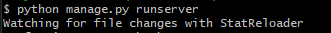
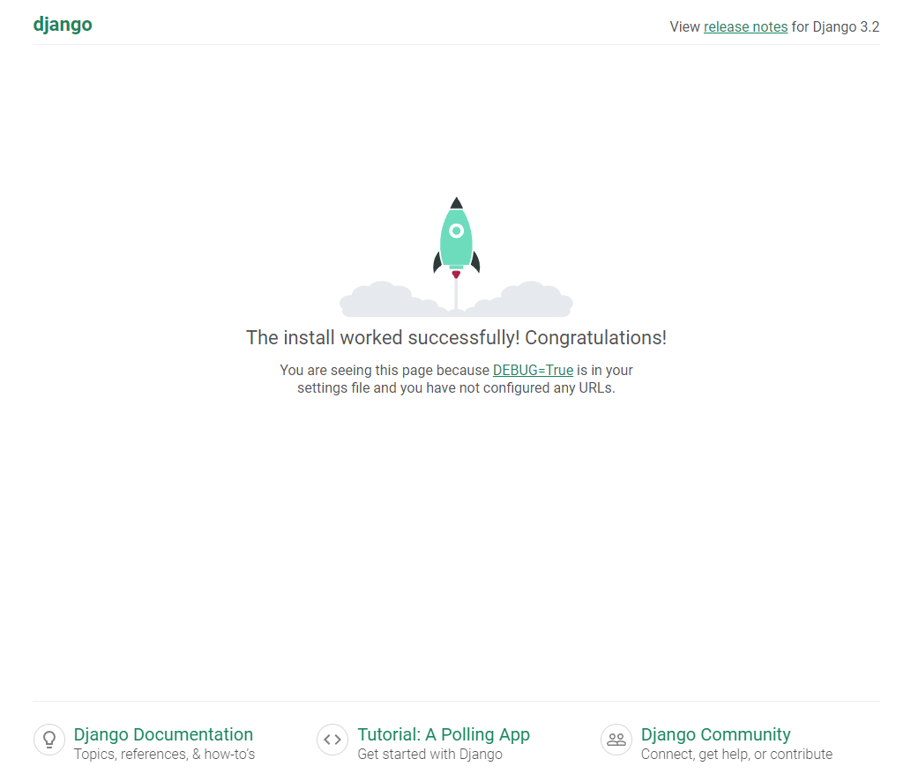

### Django 초기 세팅


#### 기초 CLI

```bash
# cd : change directory 디렉토리 이동
$ cd ~ #홈으로 이동 
$ cd .. #상위 폴더로 이동
$ . #현재 디렉토리

# 절대 경로 확인
$ pwd

# 해당 디렉토리 내 파일 확인
$ ls

$ rm -rf [filename]
# 삭제
```


#### 가상환경 생성 및 구동

```bash
# 가상 환경 설정하기
#$ python -m venv [venv-name]
$ python -m venv server-venv

# 설정한 가상 환경 구동
$ source server-venv/Scripsts/activate
$ . server-venv/Scripsts/activate


# 맥
$ . [가상환경이름]/bin/activate


# 설정한 가상 환경 종료
$ deactivate
```

- 가상환경 구동 명령어는 디렉터리에 따라 달라질 수 있음
  - `~/server/server-venv/Scripts` 환경이라면 `source ./activate` 라는 명령어로 구동 가능
  - ***현재 디렉토리 확인 후 명령어 입력!***

#### Django 설치

```bash
# 최신버전 다운로드
$ pip install django

# 특정 버전의 장고 설치
# 상용적으로 쓰기에는 안정적인 LTS 버전 사용
$ pip install django==3.2.13
 
$ pip list
# 설치 결과 확인 / 현재 설치된 pip 라이브러리 확인 가능!

# 장고 새로운 프로젝트 시작하기
#$ django-admin startproject [프로젝트 이름][시작 경로]
$ django-admin startproject firstpjt .
# 현재 폴더에(.) firstpht 라는 이름의 플젝 생성

$ code . 
# vs code 실행

# (로컬) 서버 구동
$ python manage.py runserver
>>> Watching for file changes with StatReloader
# 이 메시지가 뜨면 정상 구동!
```

- 브라우저 상에서 `localhost:8000` 입력


- 구동 결과!
  - bash 창
  - 
  
  
  
  - browser 창
  
  - 
  
    


