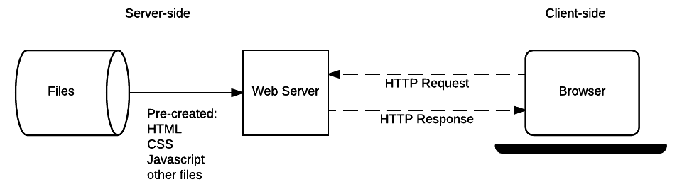

Q. IP와 도메인은 무엇일까요?

```
'인터넷'이란 각자의 컴퓨터들이 서로 연결되어 있는 네트워크 망을 말한다. 각자의 컴퓨터는 랜선(유선) 혹은 무선(블루투스, 와이파이 등)으로 연결 되어 있는데 이때 라우터, 모뎀, ISP 같은 단게를 거쳐 이어지게 된다.

 이 네트워크 망에 여러 서버들이 접속되어 있는데, 각자의 컴퓨터 혹은 서버 컴퓨터에 고유한 주소값이 정해져 있고, 이것이 ip주소이다. 아이피 주소는 '173.194.121.32' (구글) 처럼 숫자로만 이루어져 있는데, 이것을 쉽게 알아보기 위해 알파벳으로 나타낸게 '도메인' 주소이다.
```


Q. 클라이언트와 서버는 무엇일까요?

```
클라이언트는 일반적인 웹 사용자의 인터넷이 연결된 장치들(컴퓨터, 폰) 과 이런 장치들에서 이용가능한 웹에 접근하는 소프트웨어(브라우저) 입니다.

서버는 웹페이지, 사이트, 또는 앱을 저장하는 컴퓨터입니다. 클라이언트의 장비가 웹페이지에 접근하길 원할 때, 서버로부터 클라이언트의 장치로 사용자의 웹 브라우저에서 보여지기 위한 웹페이지의 사본이 다운로드 됩니다.
```




- 정적 웹 사이트의 예시


- 동적 웹 사이트의 예시

  

Q. 정적 웹 사이트와 동적 웹 사이트의 차이점은 무엇일까요? Django는 무엇을 위한 도구인가요?

```
정적 사이트는 특정 리소스가 요청될 때마다 서버에서 하드 코딩된 동일한 컨텐츠를 반환하는 사이트 입니다.

동적 사이트는 특별한 URL과 데이터 요청에 의해 생성되거나 콘텐츠를 반환할 수 있습니다
```

```
웹 프레임 워크는 일반적인 문제를 해결하고 개발 속도를 높이며 특정 도메인에서 직면하는 다양한 유형의 작업을 단순화하도록 설계된 함수, 객체, 규칙 및 기타 코드 구성 요소의 모음입니다.

Django는 이러한 웹 프레임 워크의 일종이며(server-side), 개발자가 미리 구성된 라이브러리를 활용하여 빠르게 웹사이트를 구성하는데 도움을 준다.
```


Q. HTTP는 무엇이고 요청과 응답 메시지 구성은 어떻게 되나요?


