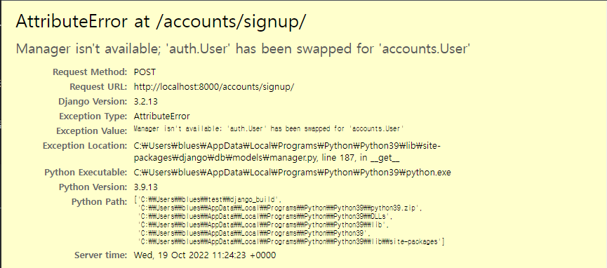
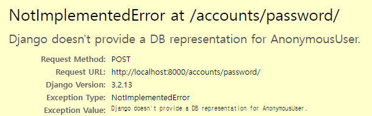

## 1. `accounts` app 생성

```bash
$python manage.py startapp accounts
```


- 앱 등록

    ```python
    # pjt/settings.py
    
    INSTALLED_APPS = [
        "articles",
        "accounts", # 새로 추가
        ...
    ]
    
    ```


- urls 분리

  ```python
  # pjt/urls.py
  
  urlpatterns = [
  	...
      path("accounts/", include("accounts.urls")),
  ]
  
  ```

  ```python
  # accounts/urls.py
  
  app_name = 'accounts'
  
  urlpatterns = [
  
  ]
  ```

  

## 2. Model 생성

```python
# pjt/settings.py

# User Model
AUTH_USER_MODEL = 'accounts.User' # settings.py 파일 맨 밑에 추가 

```


```python
# accounts/models.py

from django.db import models
from django.contrib.auth.models import AbstractUser

# Create your models here.
class User(AbstractUser):
    pass
```

- 추후에는 프로젝트 초기에 설정!
- 실습 중간에 진행 할 때는 `migrations/ ` 아래 숫자가 붙은 파일 + db.sqlite3 삭제 후 진행 
- 이후 다시 migrations 진행

```bash
$ python manage.py makemigrations 
$ python manage.py migrate
```

- 이후 기존 `auth_user 테이블`에서 `accounts_user 테이블`로 변경 된 것 확인


### 추가 라이브러리 설치

```bash
$ pip install django-extensions
$ pip install ipython

$ python manage.py shell_plus
```


- 앱 등록

```python
# pjt/settings.py

INSTALLED_APPS = [
    "articles",
    "accounts", # 새로 추가
    "django_extensions",# 새로 추가
    ...
]

```


## 3. 회원가입 기능 생성 (CREATE)

#### 3-1. urls 추가

```python
# Accounts/urls.py

from django.urls import path
from . import views

app_name = "accounts"

urlpatterns = [
    path('signup/', views.signup, name='signup'), # 추가
]
```


- `UserCreationForm`
  - [github 주소](https://github.com/django/django/blob/stable/3.2.x/django/contrib/auth/forms.py#L75)
  - 주어진 username과 password로 권한이 없는 새 user를 생성하는 ModelForm

- 📌모델 -> forms 과정이 없는 이유
- 로그인 과정에서 사용하는 `UserCreationForm()` 은 장고 auth.forms 의 기본 form 을 사용하기 때문

#### 3-2. views (GET)

```python
#accounts/views.py

from django.shortcuts import render
from django.contrib.auth.forms import UserCreationForm

# Create your views here.
def signup(request):
    form = UserCreationForm() # 장고 auth.forms의 기본 form
    context = {
        'form' : form,
    }

    return render(request, 'accounts/signup.html', context)
```


#### 3-3 templates (GET)

```django
{# accounts/templates/accounts/signup.html #}





<h3>회원가입</h3>
<form action="" method="POST">
    
    
    
  </form>


```


#### 3-4. VIEWS (POST 로 변경)

```python
#accounts/views.py

from django.shortcuts import render
from django.contrib.auth.forms import UserCreationForm

# Create your views here.
def signup(request):

    if request.method == "POST":
        form = UserCreationForm(request.POST)
        if form.is_valid():
            form.save()
            return redirect('articles:index')
    else:
        form = UserCreationForm()
    context = {
        'form' : form,
    }

    return render(request, 'accounts/signup.html', context)
```


---

​	


## 4. UserCreationForm() 커스텀 하기

- 회원가입에 사용하는 UserCreationForm이 우리가 대체한 커스텀 유저 모델이 아닌 기존 유저 모델로 인해 작성된 클래스이기 때문
- user 를 직접 호출 하기 보다는 `get_user_model()` 로 간접 호출해서 사용(django 권장 사항)

```python
# accounts/forms.py

from django.contrib.auth.forms import UserCreationForm
from django.contrib.auth import get_user_model
# from .models import User

#기본 auth.form 의 기본 UserCreationForm
class CustomUserCreationForm(UserCreationForm):

    class Meta:
        model = get_user_model()
        fields = ('username','email')
        # fields = '__all__'

```


```python
# accounts/views.py
from django.shortcuts import render, redirect
# from django.contrib.auth.forms import UserCreationForm
from .forms import CustomUserCreationForm #추가

# Create your views here.
def signup(request):

    if request.method == "POST":
        form = CustomUserCreationForm(request.POST) # 변경
        if form.is_valid():
            form.save()
            return redirect('articles:index') 
    else:
        form = CustomUserCreationForm() # 변경
    context = {
        'form' : form,
    }

    return render(request, 'accounts/signup.html', context)
```


- Django-admin 페이지에서 보려면 -> custom한 user를 사용 중이기 때문에 admin 에 추가 필요

```python
# accounts/admin.py

from django.contrib import admin
from django.contrib.auth.admin import UserAdmin
#from .models import User
from django.contrib.auth import get_user_model

admin.site.register(get_user_model(). UserAdmin)
```


## 5. login

#### 5-1. login 기능 구현

- URL

```python
# Accounts/urls.py

from django.urls import path
from . import views

app_name = "accounts"

urlpatterns = [
	...
    path('login/', views.login, name='login'), # 추가
]
```


- Views (1)

  ```python
  from django.contrib.auth.forms import AuthenticationForm
  
  def login(request):
  
      form = AuthenticationForm()
  
      context = {
          'form': form,
      }
  
      return render(request, 'accounts/login.html', context)
  ```

- template

```django




  

  
  

  <h1>로그인</h1>
  <div class="container">
    <form action="" method="POST">
      
      
      <input type="submit">
    </form>
  </div>

```


Views (2) - POST 방식으로 변경

```python
from django.contrib.auth.forms import AuthenticationForm

def login(request):

	if request.method == "POST"
    	pass
    else:
        form = AuthenticationForm()
    
    context = {
        'form': form,
    }

    return render(request, 'accounts/login.html', context)
```


views (3) - 로직 구현

```python
from django.contrib.auth.forms import AuthenticationForm
from django.contrib.auth import login as auth_login #추가


def login(request):

	if request.method == 'POST':
        # AuthenticationForm은 ModelForm이 아님!
        form = AuthenticationForm(request, data=request.POST)
        if form.is_valid():
            # 세션에 저장
            # login 함수는 request, user 객체를 인자로 받음 
            # user 객체는 어디있어요? 바로 form에서 인증된 유저 정보를 받을 수 있음
            auth_login(request, form.get_user()) 
            #기존 login 함수와 이름이 겹쳐서 auth_login 으로 교체
            return redirect('articles:index')
    else:
        form = AuthenticationForm()
        
	context = {
        'form': form,
    	}

    return render(request, 'accounts/login.html', context)
```

- `get_user()`
  - AuthenticationForm의 인스턴스 메서드
  - 유효성 검사를 통과했을 경우 로그인 한 사용자 객체를 반환


#### 5-2. 로그인 시에만 특정한 동작이 가능하게 구성하기

##### (1) 출력

```django
 
   	<span>{{ request.user }}</span>
	 {{ user }}도 가능 
    <a href="">로그아웃</a>
 
    <a href="">회원가입</a>
    <a href="">로그인</a>
 

```


##### (2) 서버사이드 (view)

- if ~ else 문 활용

```python
#articles/views.py

def create(request):
	if request.user.is_athenticated:
		# 기존 내용
        # if request.method == "POST":
    #     article_form = ArticleForm(request.POST)
    #     if article_form.is_valid():
    #         article_form.save()
    #         return redirect("articles:index")
    # else:
    #     article_form = ArticleForm()
    # context = {
    #     "article_form": article_form,
    # }  
    else:
    	return redirect('accounts:login')
 
```


- `@login_required`


```python
#articles/views.py

from django.contrib.auth.decorators import login_required # 로그인 데코레이션을 쓰기 위해


@login_required
def create(request):
```

-> 이 경우 `http://127.0.0.1:8000/accounts/login/next=/articles/1/update/` 로 이동


📌`@login_required` 만 붙여도, login 페이지로 이동은 가능! but 로그인 이후에 다시 작업중이던 페이지로 이동하기 위해 next 쿼리문 처리가 필요함!


```python
#account/views.py

def login(request):
    if request.method == 'POST':
        form = AuthenticationForm(request, data=request.POST)
        if form.is_valid():
            auth_login(request, form.get_user())
           #http://127.0.0.1:8000/accounts/login/next=/articles/1/update/
            # request.GET.get('next') : /articles/1/update/
            if request.GET.get('next'):
                return redirect(request.GET.get('next'))
            else:
                return redirect('articles:index')
    else:
        form = AuthenticationForm()
    context = {
        'form': form
    }
    return render(request, 'accounts/login.html', context)
```

또는

```python
#account/views.py

def login(request):
    if request.method == 'POST':
        form = AuthenticationForm(request, data=request.POST)
        if form.is_valid():
            auth_login(request, form.get_user())
           #http://127.0.0.1:8000/accounts/login/next=/articles/1/update/
            # request.GET.get('next') : /articles/1/update/             
            return redirect(request.GET.get('next') or 'articles:index')
    else:
        form = AuthenticationForm()
    context = {
        'form': form
    }
    return render(request, 'accounts/login.html', context)
```


#### 5-3 회원가입 후 로그인 유지

```python
def signup(request):

    if request.method == "POST":
        form = UserCreationForm(request.POST)
        if form.is_valid():
            user = form.save()
            # ModelForm 의 save 메서드의 리턴값은 해당 모델의 인스턴스다
            auth_login(request, user) # 로그인
            return redirect('articles:index')
    else:
        form = UserCreationForm()
    context = {
        'form' : form,
    }

    return render(request, 'accounts/signup.html', context)
```


## 6. Logout 구현

```python
# views/urls.py
urlpatterns = [
    ...
    path("logout/", views.logout, name="logout"), #추가
]
```


```python
from django.contrib.auth import logout as auth_logout #추가

def logout(request):
	auth_logout(request)
	return reditrect('articles:index')
```


## 7. 회원정보 수정(update)

- `UserChangeForm` 
  - 사용자의 정보 및 권한을 변경하기 위해 admin 인터페이스에서 사용되는 ModelForm
  - `UserCreation` 과 같이 Custom 해서 사용 -> `CustomUserChangeForm`


- forms.py

```python
# accounts/forms.py
from django.contrib.auth import get_user_model
from django.contrib.auth.forms import UserChangeForm


class CustomUserChangeForm(UserChangeForm):
    class Meta(UserChangeForm):
        model = get_user_model()
        fields = ["email", "first_name", "last_name"]
        #fields = "__all__"

```


- urls

```python
# views/urls.py
urlpatterns = [
    ...
    path("<int:pk>/update/", views.update, name="update"), #추가
    #또는 
    path("update/", views.update, name="update"),
    # update 페이지 설계 방법에 따라 다름
]
```


- templates

```django
 accounts/update.html 








<form action="" method="POST">
  
  

  <input class="btn btn-outline-primary" type='submit' value="수정완료">

</form>

```


- view (form 생성)

```python
from .forms import CustomUserCreationForm, CustomUserChangeForm #추가
from django.contrib.auth import get_user_model #기존에 있는지 확인

# case 1:
# 관리자가 회원 정보 확인할 때
def update(request, user_pk):

    user = get_user_model().objects.get(pk=user_pk)

    form = CustomUserChangeForm(instance=user)

    context = {
        "form": form,
    }

    return render(request, "accounts/update.html", context)

# case 2:
# 로그인한 유저의 본인 정보 수정
def update2(request):

    form = CustomUserChangeForm(instance=request.user)

    context = {
        "form": form,
    }

    return render(request, "accounts/update.html", context)
```


- view (로직 구현)

```python
# case 1:
# 관리자가 회원 정보 확인할 때
def update(request, user_pk):

    user = get_user_model().objects.get(pk=user_pk)

    if request.method == "POST":
        form = CustomUserChangeForm(request.POST, instance=user)
        # form = CustomUserChangeForm(data=request.POST, instance=user)
        if form.is_valid():
            form.save()
            return redirect("accounts:detail", user.pk)
    else:
        form = CustomUserChangeForm(instance=user)
    context = {
        "form": form,
    }
    return render(request, "accounts/update.html", context)


# case 2:
# 로그인한 유저의 본인 정보 수정
def update2(request):

    if request.method == "POST":
        form = CustomUserChangeForm(request.POST, instance=request.user)
        # form = CustomUserChangeForm(data=request.POST, instance=request.user)
        if form.is_valid():
            form.save()
            return redirect("accounts:detail")
    else:
        form = CustomUserChangeForm(instance=request.user)
    context = {
        "form": form,
    }

    return render(request, "accounts/update.html", context)
```


## 8. 비밀번호 변경

- `PasswordChangeForm`
  - 이전 비밀번호를 입력하여 비밀번호를 변경할 수 있도록 함
  - 이전 비밀번호를 입력하지 않고 비밀번호를 설정할 수 있는 `SetPasswordForm`을 상 속받는 서브 클래스


- urls

```python
# accounts/urls.py

urlpatterns = [
    ...
    path("password/", views.change_password, name="change_password"), #추가
]
```


- views

```python
from django.contrib.auth.forms import AuthenticationForm, PasswordChangeForm # 확인 및 추가


def change_password(request):

    if request.method == "POST":
        form = PasswordChangeForm(request.user, request.POST)
        # form = PasswordChangeForm(user=request.user, data=request.POST)
        if form.is_valid():
            form.save()
            return redirect("accounts:detail")
    else:
        form = PasswordChangeForm(request.user)
    context = {
        "form": form,
    }

    return render(request, "accounts/change_password.html", context)

```


- templates

```django






<form action="" method="POST">
  
  

  <input class="btn btn-outline-primary" type='submit' value="수정완료">

</form>

```


- 로그인 하지 않고 삭제 하려 하면 이런 에러가 발생




### 8-1. 암호 변경 시 세션 무시

- 비밀번호가 변경되면 기존 세션과의 회원 인증 정보가 일치하지 않게 되어 버려 로그인 상태가 유지되지 못함


```python
# accounts/views.py

from django.contrib.auth import update_session_auth_hash # 추가


def change_password(request):

    if request.method == "POST":
        form = PasswordChangeForm(request.user, request.POST)
        if form.is_valid():
            form.save()
            update_session_auth_hash(request, form.user) # 추가
            return redirect("accounts:detail")
    else:
        form = PasswordChangeForm(request.user)
    context = {
        "form": form,
    }

    return render(request, "accounts/change_password.html", context)
```

- `update_session_auth_hash(request, user)`
  - 현재 요청(current request)과 새 session data가 파생 될 업데이트 된 사용자 객체를 가져오고, session data를 적절하게 업데이트해줌
  - 암호가 변경되어도 로그아웃 되지 않도록 새로운 password의 session data로 session을 업데이트


## 9. logout

```python
# accounts/views.py

def delete(request):
    request.user.delete()
    auth_logout(request)
```

- 📌 반드시 ***1. 탈퇴 후 -> 2. 로그아웃*** 으로 진행 (순서 중요!)
  - 먼저 로그아웃 해버리면 해당 요청 객체 정보가 없어지기 때문에 탈퇴에 필요한 정보 또한 없어지기 때문 

