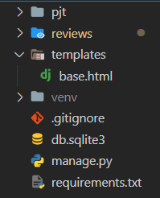
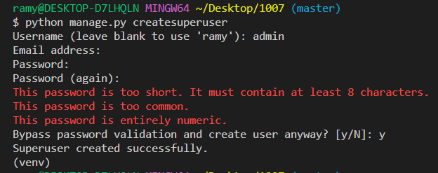
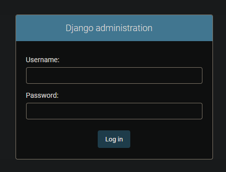
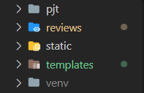
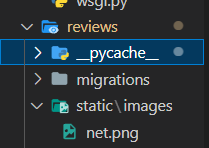

# Django CRUD 

> Django : 파이썬 기반 웹 프레임워크 

## 1. 가상환경 및 Django 설치

> 가상환경 : 프로젝트별 별도 패키지 관리

### 1-1. 가상환경 생성 및 실행

* 가상환경 폴더를 `.gitignore`로 설정을 해둔다.

```bash
$ python -m venv venv
$ source venv/Scripts/activate
(venv) $
```

### 1-2. Django 설치 및 기록

```
$ pip install django==3.2.13
$ pip freeze > requirements.txt
```

### 1-3. Django 프로젝트 생성

```bash
$ django-admin startproject pjt .
```

## 2. articles app 

> Django : 주요 기능 단위의 App 구조, App 별로 MTV를 구조를 가지는 모습 + `urls.py` 

### 2-1. app 생성

```bash
$ python manage.py startapp app_name
```

### 2-2. app 등록

* `settings.py` 파일의 `INSTALLED_APPS`에 추가

```python
INSTALLED_APPS = [
    'articles',
    ...
]
```

### 2-3. urls.py 설정

> app 단위의 URL 관리

```python
# pjt/urls.py
from django.contrib import admin
from django.urls import path, include #include 추가

urlpatterns = [
    ...
    path('articles/', include('articles.urls')),
]
```

```python
# articles/urls.py
from django.urls import path 
from . import views

app_name = 'articles'

urlpatterns = [
  # localhost:8000/articles/
  # http://127.0.0.1:8000/articles/
  path('', views.index, name='index'),
  ...
]
```

* 활용 : `articles:index` => `/articles/`

* Template에서 활용 예시
```django

```

* View에서 활용 예시

```python
redirect('articles:index')
```

## 3. Model 정의 (DB 설계)

### 3-1. 클래스 정의

```python
class Article(models.Model):
    title = models.CharField(max_length=20)
    content = models.TextField()
    created_at = models.DateTimeField(auto_now_add=True)
    updated_at = models.DateTimeField(auto_now=True)
```

### 3-2. 마이그레이션 파일 생성

* app 폴더 내의 `migrations` 폴더에 생성된 파일 확인

```bash
$ python manage.py makemigrations
```

### 3-3. DB 반영(`migrate`)

```bash
$ python manage.py migrate
```

## 4. CRUD 기능 구현

### 4-0. ModelForm 선언

> 선언된 모델에 따른 필드 구성 (1) Form 생성 (2) 유효성 검사

```python
# articles/forms.py 생성

from django import forms
from .models import Article

class ArticleForm(forms.ModelForm):

    class Meta:
        model = Article
        fields = ['title', 'content']
        # 또는 전부다 설정
        # fields = "__all__"
```

### 4-1. 게시글 생성 (CREATE)

> 사용자에게 HTML Form 제공, 입력받은 데이터를 처리 (ModelForm 로직으로 변경)

#### 1. HTML Form 제공

> GET http://127.0.0.1:8000/articles/create/

##### (1) urls.py 

```html
<!-- index.html -->

<a href=""><button>새 글 생성</button></a>
<!-- button 자체엔 action이 안되서 a 태그 -->
```

```python
# articles/urls.py
app_name = "articles"

urlpatterns = [
  path('', views.index, name='index'),
  path('create/', views.create, name='create'), # 추가
]
```


##### (2) views.py

```python
def create(request):
    article_form = ArticleForm()
    context = {
        'article_form': article_form
    }
    return render(request, 'articles/create.html', context=context)
```


##### (3) articles/create.html

* HTML Form 태그 활용시 핵심

  * 어떤 필드를 구성할 것인지 (`name`, `value`)

  * 어디로 보낼 것인지 (`action`, `method`)

```django
<h1>글쓰기</h1>
<form action="" method="POST">
  
  {{ article_form.as_p }}
  <input type="submit" value="글쓰기">
  {# <button type="submit">제출하기</button> #}
</form>
```


#### 2. 입력받은 데이터 처리

> POST http://127.0.0.1:8000/articles/create/

> 게시글 DB에 생성하고 index 페이지로 redirect

##### (1) urls.py

##### (2) views.py

* GET 요청 처리 흐름

* POST 요청 처리 흐름 (주의! invalid)

```python
from articles.forms import ArticleForm # 자동 임포트 혹은 직접 추가
from django.shortcuts import redirect, render # redirect 추가


def create(request):
    if request.method == "POST":
        article_form = ArticleForm(request.POST)
        if article_form.is_valid():
            # 유효성 검사 통과했다면 저장, 아니면 context 부터
            article_form.save()
            # 성공적으로 저장 후에는 다시 인덱스 페이지로
            return redirect("articles:index")
    else:
        # method=GET:  이 페이지에 처음 들어왔으면 (index -> create)
        article_form = ArticleForm()

    context = {
        "article_form": article_form,
    }
    return render(request, "articles/create.html", context)
```

### 4-2. 게시글 목록 (READ_1)

> DB에서 게시글을 가져와서, template에 전달

```python
# articles/views.py

from .models import Article # 자동 임포트 혹은 직접 추가

def index(request):

    articles_ = Article.objects.order_by("-pk")

    context = {
        "articles": articles_,
    }

    return render(request, "articles/index.html", context)
```

```html
<!-- index.html -->

<h3>This is index page.</h3>

<a href=""><button>새 글 생성</button></a>



<p>{{ article.pk }} | {{ article.title }}</p>
<p>{{ article.created_at }} </p>
<hr>


```


### 4-3. 상세보기 (READ_2)

> 특정한 글을 본다.

> http://127.0.0.1:8000/articles/<int:pk>/

```html
<!-- index.html -->
<h3>This is index page.</h3>

<a href=""><button>새 글 생성</button></a>



<p>{{ article.pk }} | 
   <!-- url에 pk 값을 함께 넘겨줌 -->
  <a href=""> {{ article.title }}</a> 
  | {{ article.created_at }} </p>
<hr>


```

```python
# articles/urls.py
from django.urls import path
from . import views

app_name = "articles"

urlpatterns = [
    path("", views.index, name="index"),
    path("create/", views.create, name="create"),
    path("detatil/<int:pk_>", views.detail, name="detail"),
    #url에 pk 값을 함께 넘겨줌
]

```

```python
# articles/views.py

# pk 값을 인자로 받음
def detail(request, pk_): # 이때, url에 선언된 변수명과 동일해야 함

    article = Article.objects.get(pk=pk_)

    context = {
        "article": article,
    }

    return render(request, "articles/detail.html", context)
```

```html
<!-- detail.html -->

<h3>상세 보기 페이지 입니다 </h3>

<h2>{{ article.title }}</h2>
<p>{{ article.created_at }} | {{ article.updated_at }}</p>
<p>{{ article.content }}</p>
```


### 4-4. 삭제하기 (DELETE)

> 특정한 글을 삭제한다.

> http://127.0.0.1:8000/articles/<int:pk>/delete/

```python
# articles/urls.py

from django.urls import path
from . import views

app_name = "articles"

urlpatterns = [
  path('', views.index, name='index'),
  path("create/", views.create, name='create'),
  path("<int:pk>/", views.detail, name="detail"),
  path("<int:pk>/delete", views.delete, name="delete"), # 추가
]

```

```python
# articles/views.py
from django.urls import path, include # include 추가


def delete(request, pk):

  article = Article.objects.get(pk=pk)
  article.delete()

  return redirect("articles:index")
```


### 4-5. 수정하기 (UPDATE)

> 특정한 글을 수정한다. => 사용자에게 수정할 수 양식을 제공하고(GET) 특정한 글을 수정한다.(POST)

> http://127.0.0.1:8000/articles/<int:pk>/update/

```python
# articles/urls.py
from django.urls import path
from . import views

app_name = "articles"

urlpatterns = [
  path('', views.index, name='index'),
  path("create/", views.create, name='create'),
  path("<int:pk>/", views.detail, name="detail"),
  path("<int:pk>/delete", views.delete, name="delete"),
  path("<int:pk>/update", views.update, name="update"), # 추가
]
```

```python
# articles/views.py

def update(request, pk): #pk 값을 받아와서

  movie = Movies.objects.get(pk=pk) #해당 객체를 불러오고
  if request.method == 'POST':
       									 #인스턴스 인자로 전달
    movie_form = MoviesForm(request.POST, instance=movie) 
    if movie_form.is_valid():
      movie_form.save()
      return redirect('movies:detail', movie.pk) #pk 값을 같이 넘겨줌!
  else:
    movie_form = MoviesForm(instance=movie) #인스턴스 인자만 전달!
  context = {
    'movies_form' : movie_form,
  }

  return render(request, 'movies/update.html', context)
```


## 5. 기타 설정

### 5-1. `base.html` templates 상속

#### (1) templates 폴더 생성

`* 이 폴더의 위치가 매우 중요` -> project / app 폴더와 같은 레벨에 설정



#### (2) `settings.py` > Templates 에 주소 추가

```python
# pjt/settings.py

TEMPLATES = [
	{
		...
		"DIRS": [BASE_DIR / "templates" ], 
        # BASE_DIR은 프로젝트 폴더의 상대경로를 뜻함
		...
	}
]

```


#### (3) `base.html`

```django
<!-- templates/base.html -->

<!DOCTYPE html>
<html lang="en">
<head>
  <meta charset="UTF-8">
  <meta http-equiv="X-UA-Compatible" content="IE=edge">
  <meta name="viewport" content="width=device-width, initial-scale=1.0">
  <title>Document</title>
</head>
<body>
  

  
</body>
</html>
```


#### (4) 상속 받는 `html` 파일

```django





<p> 여기에 내용이 추가 됩니다. </p>


```


### 5-2. admin 계정 생성

#### (1) admin 계정 생성

```bash
$ python manage.py createsuperuser
```

- username과 password 를 입력 ( email은 선택 사항, enter 로 skip 가능)



- password는 터미널 창에 표시 되지 않는 것이 정상




#### (2) 모델의 record 를 보기 위해 admin.py에 등록

```python
# articles/admin.py

from django.contrib import admin
from .models import Article

admin.site.register(Article)
```


### 5-3. 이미지 파일 & CSS.sheet 삽입 (static)

#### (1) settings.py 

```python
# Installed_apps 에서 확인
INSTALLED_APPS = [
...
    "django.contrib.staticfiles",
]


# 아래 내용 추가
STATIC_URL = "/static/"

STATICFILES_DIRS = [
    BASE_DIR / "static",
]
```


#### (2) 해당 HTML 에서

```django


 
```

- 위 주소는 static 폴더가 pjt / app / templates 와 같은 레벨에 위치할 경우



```django


 
```

- 위 주소는 static 폴더가 app 하위 레벨에 위치할 경우




### 5-4. Django-bootstrap


#### (1) [django-bootstrap5](https://pypi.org/project/django-bootstrap5/) 설치


```bash
$ pip install django-bootstrap5
```


#### (2) settings.py 에 추가

```python
# settings.py

INSTALLED_APPS = (
    # ...
    "django_bootstrap5", #언더바 유의!
    # ...
)
```


#### (3) 각 html 에서 사용

- `load` 는 import 의 개념으로 매번 추가 해줘야 함
- 이때 `base.html` 상속을 받는 중이라면 ` ~ ` 사이에 load 내용이 추가

```django





{# 아래 세줄이 매번 추가 되야 함! #}
  {# 언더바 유의! #}




<form action="/url/to/submit/" method="post" class="form">
    

     {# 이때도 {{ 내용 }} 이 아님! #}

    
    
</form>


```


## 추천 문서

* [HTTP request & response object](https://docs.djangoproject.com/en/4.1/ref/request-response/)

* [ModelForm](https://docs.djangoproject.com/en/4.1/topics/forms/modelforms/)

* [Django view shortcut functions](https://docs.djangoproject.com/en/4.1/topics/http/shortcuts/)