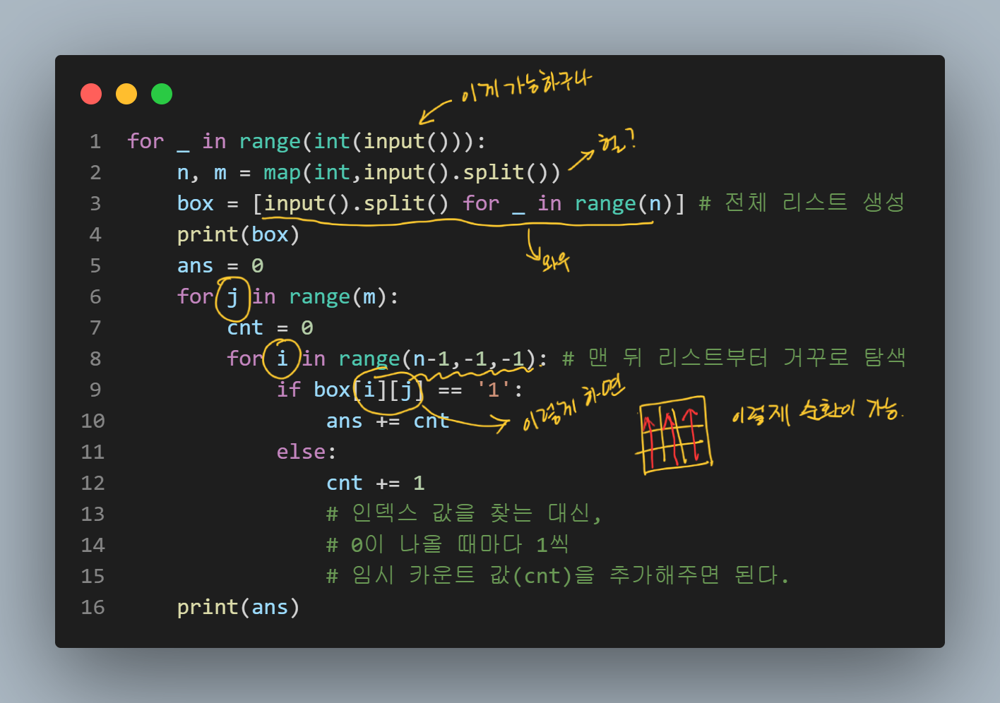

- [BOJ_9455 박스](https://www.acmicpc.net/problem/9455)

### <문제> BOJ_9455 박스: 문제 설명
```ad-question
 - m행 n열로 이루어진 그리드가 주어진다. 일부 칸에는 박스가 들어 있다. 모든 박스가 더 이상 움직일 수 없을 때 까지 아래로 움직인다면, 박스는 쌓여진 상태가 된다.

- 그림 (a)의 그리드의 크기는 5행 4열이고, 7칸에는 박스가 들어있다. 모든 박스가 계속해서 아래로 움직이면, 그림 (b)와 같이 변하게 된다.


- 박스가 움직인 거리는 바닥에 쌓이기 전 까지 이동한 칸의 개수이다. 예를 들어, 맨 왼쪽 열에서 가장 위에 있는 박스가 움직인 거리는 2이다. 모든 박스가 이동한 거리 (각 박스가 이동한 거리의 합) 을 구하는 프로그램을 작성하시오. 위의 예제에서 박스 7개가 움직인 거리는 8이다.
```

```ad-attention
- 난이도: Bronze 1
- 시간제한: ==1초==
- 메모리 제한: ==256MB==

- ==입력== 
	- 첫째 줄에 테스트 케이스의 개수 T가 주어진다. 각 테스트 케이스의 첫째 줄에는 m과 n이 주어진다. (1 ≤ m, n ≤ 100) 다음 m개 줄에는 그리드의 각 행의 정보를 나타내는 n개의 정수가 주어진다. 그리드 첫 행부터 마지막 행까지 순서대로 주어진다. 박스가 들어있는 칸은 1로, 다른 칸은 0으로 주어진다. 각 정수 사이에는 공백이 하나 주어진다.

- ==출력==
	- 각 테스트 케이스마다 입력으로 주어진 그리드에서 모든 박스가 이동한 거리를 출력한다.
- ==예제 입력==
	```python
	3
	5 4
	1 0 0 0
	0 0 1 0
	1 0 0 1
	0 1 0 0
	1 0 1 0
	3 3
	1 1 1
	1 1 1
	0 0 0
	5 6
	1 0 1 1 0 1
	0 0 0 0 0 0
	1 1 1 0 0 0
	0 0 0 1 1 1
	0 1 0 1 0 1
	```
- ==예제 출력==
	```python
	8
	6
	16
	```
```


#### 문제 해결 아이디어
```ad-example
1. Test Case 수 / 행과 열의 수 / input 값들을 각각 입력 받는다
2. 현 상태로는 조작이 어렵다고 판단, 행렬을 왼쪽으로 90도 회전한다.
	- ex) 5 by 4 → 4 by 5
3. 해당행에 1이 있는지 확인한다. 
	- '0000' 과 같이 0만 있는 행도 있지 않을까?
4. 이때 각 행에 1이 몇개 있는지 확인
5. `sum(matrix[i][1의 개수: ])`이 1의 개수와 같은지 확인하는 조건을 세운다
	- ⇒ 박스가 더 이상 움직일 필요가 없는지 확인하는 과정
6. 같지 않다면 0과 1의 위치를 계속 swipe 하면서 카운팅을 한다.
7. 각 케이스별로 카운팅한 결과를 출력한다.
```

#### 내 코드
```python
# BOJ_9455 박스
# ! 왜 또 테케는 맞는데, 틀렸다고 나오냐!!!!!

import sys
sys.stdin = open("BOJ_9455_input.txt", "r")


# import sys 
# input = sys.stdin.readline

from pprint import pprint


T = int(input())

for t in range(T):
    # todo 입력 부분
    mn = list(map(int, input().split()))
    m = mn[0]
    n = mn[1]

    matrix = [[] for _ in range(m)]
    for i in range(m):
        matrix[i].extend(list(map(int, input().split())))

    # pprint(matrix)

    # todo 리스트 회전하는 부분
    t_mx = [[0]* m for _ in range(n)]

    for i in range(n):
        for j in range(m):
            t_mx[i][j] = matrix[j][i]

    # pprint(t_mx)

    cnt = 0
    for j in range(n):
        # todo 1이 (박스가) 없는 경우도 고려
        print()
        print(f"바뀐 {j+1}번 행")
        if 1 not in t_mx[j]:
            break
        one_cnt = t_mx[j].count(1) 
        
        while True:
        
            if one_cnt == sum(t_mx[j][-one_cnt:]):
                break
            print("변하기 전", t_mx[j])
            for i in range(m-1):
                if t_mx[j][i] == 1 and t_mx[j][i+1] == 0:
                    t_mx[j][i+1] = 1
                    t_mx[j][i] = 0
                    cnt += 1
                    print("변한 후", t_mx[j])
    print(cnt)
        

```

```shell

바뀐 1번 행
변하기 전 [1, 0, 1, 0, 1]
변한 후 [0, 1, 1, 0, 1]
변한 후 [0, 1, 0, 1, 1]
변하기 전 [0, 1, 0, 1, 1]
변한 후 [0, 0, 1, 1, 1]

바뀐 2번 행
변하기 전 [0, 0, 0, 1, 0]
변한 후 [0, 0, 0, 0, 1]

바뀐 3번 행
변하기 전 [0, 1, 0, 0, 1]
변한 후 [0, 0, 1, 0, 1]
변한 후 [0, 0, 0, 1, 1]

바뀐 4번 행
변하기 전 [0, 0, 1, 0, 0]
변한 후 [0, 0, 0, 1, 0]
변한 후 [0, 0, 0, 0, 1]
8

바뀐 1번 행
변하기 전 [1, 1, 0]
변한 후 [1, 0, 1]
변하기 전 [1, 0, 1]
변한 후 [0, 1, 1]

바뀐 2번 행
변하기 전 [1, 1, 0]
변한 후 [1, 0, 1]
변하기 전 [1, 0, 1]
변한 후 [0, 1, 1]

바뀐 3번 행
변하기 전 [1, 1, 0]
변한 후 [1, 0, 1]
변하기 전 [1, 0, 1]
변한 후 [0, 1, 1]
6

바뀐 1번 행
변하기 전 [1, 0, 1, 0, 0]
변한 후 [0, 1, 1, 0, 0]
변한 후 [0, 1, 0, 1, 0]
변한 후 [0, 1, 0, 0, 1]
변하기 전 [0, 1, 0, 0, 1]
변한 후 [0, 0, 1, 0, 1]
변한 후 [0, 0, 0, 1, 1]

바뀐 2번 행
변하기 전 [0, 0, 1, 0, 1]
변한 후 [0, 0, 0, 1, 1]

바뀐 3번 행
변하기 전 [1, 0, 1, 0, 0]
변한 후 [0, 1, 1, 0, 0]
변한 후 [0, 1, 0, 1, 0]
변한 후 [0, 1, 0, 0, 1]
변하기 전 [0, 1, 0, 0, 1]
변한 후 [0, 0, 1, 0, 1]
변한 후 [0, 0, 0, 1, 1]

바뀐 4번 행
변하기 전 [1, 0, 0, 1, 1]
변한 후 [0, 1, 0, 1, 1]
변한 후 [0, 0, 1, 1, 1]

바뀐 5번 행
변하기 전 [0, 0, 0, 1, 0]
변한 후 [0, 0, 0, 0, 1]

바뀐 6번 행
변하기 전 [1, 0, 0, 1, 1]
변한 후 [0, 1, 0, 1, 1]
변한 후 [0, 0, 1, 1, 1]
16
```
- 검증을 위해 출력 결과를 조작해서 출력해 봐도, 맞는 거 같은데, 왜지... 뭐지...

#### 구글링한 코드

##### case 1
- 박스의 세로줄을 기준으로 박스(1)가 나올 때마다 그 거리를 더해주면 최종 거리가 나온다.
```python
for _ in range(int(input())):
    m, n = map(int, input().split())
    b = []
    # * 하나의 리스트로 받아서 
    for i in range(m):
        l = list(map(int, input().split()))
        b.insert(0, l)
    arr = []
    # * 여기서 회전된 배열을 만든다. 
    for j in range(n):
        tmp = []
        for k in range(m):
            tmp.append(b[k][j])
        arr.append(tmp)
    cnt = 0
    for a in arr:
        t = 0
        print()
        print(a)
        for idx, num in enumerate(a):
            if num == 1:
                cnt += idx - t
                t += 1
    print(cnt)
```
- 출처: https://asadal.github.io/2021-01-12-%E1%84%87%E1%85%A1%E1%86%A8%E1%84%89%E1%85%B3/

```ad-hint
1.  입력되는 숫자를 리스트(l)로 만들어 전체 리스트(b)에 넣되, 나중에 생성되는 리스트가 앞에 오게 만든다. `append` 대신 `insert` 메소드를 쓴 이유다. (박스 세로줄을 기준으로 아래부터 읽어나가야 하기 때문에.)
2.  세로줄을 기준으로 리스트를 재배치(arr)한다. (~~굳이 왜…~~)
3.  최종 정렬된 리스트(arr)를 반복 순환하며 ‘1’이 나올 때마다 cnt에 추가한다. 1의 인덱스 값에서 앞선 1의 숫자만큼을 빼준다. (그게 움직인 거리니까.)
```

- 👉 1이 나올 때 마다 거리를 더해준다는 개념은 이해를 했는데, 3번째 for문 구조를 아무리 봐도 이해가 안 된다;; 라고 적는 순간 이해가 되네... **인덱스 값에서 1의 개수(t)** 뺀다는 얘기구나;;

##### case 2
```python
for _ in range(int(input())):
    n, m = map(int,input().split())
    box = [input().split() for _ in range(n)] # 전체 리스트 생성
    print(box)
    ans = 0
    for j in range(m):
        cnt = 0
        for i in range(n-1,-1,-1): # 맨 뒤 리스트부터 거꾸로 탐색
            if box[i][j] == '1':
                ans += cnt
            else:
                cnt += 1 # 인덱스 값을 찾는 대신, 0이 나올 때마다 1씩 임시 카운트 값(cnt)을 추가해주면 된다.
    print(ans)
```
- 이 코드를 가져온 블로그 주인도 그랬지만, 나도 읽으면서 감탄사가 절로 나오네;;


```ad-tip
- 1번줄, T 케이스 입력
- 2번줄, 2개 인자를 바로 입력 및 할당
- 3번줄, 여러 줄의 입력을 받아 한번에 리스트에 추가 (할당?)
- 8, 9번째 줄에서 **행과 열을 바꾸지 않고도 역행해서 순환** 
```