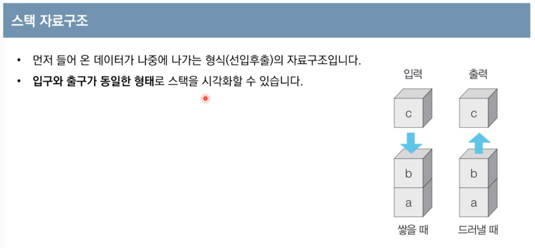

#algorithm 

# 01. 가장 기본이 되는 자료구조 - 스택과 큐

#### 스택 자료구조



- 작동방식1 (삭제 이전까지)


- 작동방식2 (모든 동작이 완료 후)


- LIFO (Last In First Out) or FILO (First In Last Out, 선입후출)
- 박스 쌓기와 비슷하다. 박스를 쌓을 때는 아래에서 위로 순서대로 쌓아 올리고, 박스를 치울 때는 반대로 위에서 부터 아래로 치우게 된다.
- 먼저 들어 온 데이터가 나중에 나가는 형식(선입후출)의 자료구조 입니다. 
- 입구와 출구가 동일한 형태로 스택을 시각화할 수 있습니다. 

```python
stack = []

# 삽입(5)-삽입(2)-삽입(3)-삽입(7)-삭제()-삽입(1)-삽입(4)-삭제() 
stack.append(5) # [5]
stack.append(2) # [5, 2]
stack.append(3) # [5, 2, 3]
stack.append(7) # [5, 2, 3, 7]
stack.pop()  # [5, 2, 3]
stack.append(1) # [5, 2, 3, 1]
stack.append(4) # [5, 2, 3, 1, 4]
stack.pop() # [5, 2, 3, 1]

# 최상단 원소부터 출력
print(stack[::-1]) # [1, 3, 2, 5]
# 최하단 원소부터 출력
print(stack) # [5, 2, 3, 1]

```


#### 큐 자료구조

-  FIFO (First In First Out)
-  먼저 들어 온 데이터가 먼저 나가는 형식(선입선출)의 자료구조입니다.
-  '가장 공평한 자료구조'
   -  ex) 은행창구 대기열, 놀이공원 대기줄
- 

-  큐는 입구와 출구가 모두 뚫려 있는 터널과 같은 형태로 시각화 할 수 있습니다. 

- 작동방식1 (최초 삭제 실행 이전 상태)


- 작동방식2 (모든 연산이 종료된 후)


- 💡**리스트만으로도 큐 자료구조를 구현할 수 있으나, 기능적으로는 동일하나, 시간 복잡도 상으로 손해를 보기 때문에 반드시 deque 라이브러리를 사용할 것!**
	→ deque 라이브리리는 스택과 큐의 장점을 합친 형태
```python
from collections import deque

# 큐(queue) 구현을 위해 deque 라이브러리 사용
queue = deque()

# 삽입(5)-삽입(2)-삽입(3)-삽입(7)-삭제()-삽입(1)-삽입(4)-삭제()
# 오른쪽으로 in / 왼쪽으로 out
queue.append(5)
queue.append(2)
queue.append(3)
queue.append(7)
queue.popleft()
queue.append(1)
queue.append(4)
queue.popleft()

# 먼저 들어온 순서대로 출력
print(queue)
# 역순으로 바꾸기
queue.reverse()
# 나중에 들어온 원소부터 출력
print(queue)

>>> deque([3, 7, 1, 4])
>>> deque([4, 1, 7, 3])
```

- `deque` 의 경우, 앞뒤 양방향에서 push와 pop 연산이 가능하다.
  - `queue.popleft()` : 먼저 넣은 자료 우선 꺼내기
  -  `queue.pop()` : 나중에 넣은 자료 먼저 꺼내기
