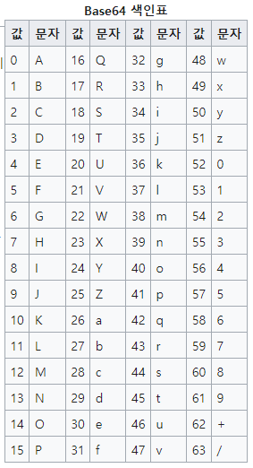
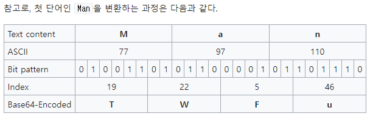

#### Base64 ?
> 컴퓨터 분야에서 쓰이는 **Base 64** (베이스 육십사)란 8비트 이진 데이터(예를 들어 [실행 파일](https://ko.wikipedia.org/wiki/%EC%8B%A4%ED%96%89_%ED%8C%8C%EC%9D%BC "실행 파일")이나, [ZIP](https://ko.wikipedia.org/wiki/ZIP "ZIP") 파일 등)를 [문자 코드](https://ko.wikipedia.org/wiki/%EB%AC%B8%EC%9E%90_%EC%BD%94%EB%93%9C "문자 코드")에 영향을 받지 않는 공통 ASCII 영역의 문자들로만 이루어진 일련의 문자열로 바꾸는 [인코딩](https://ko.wikipedia.org/wiki/%EC%9D%B8%EC%BD%94%EB%94%A9 "인코딩") 방식을 가리키는 개념이다.
> 
>원래 **Base 64**를 글자 그대로 번역하여 보면 64진법이란 뜻이다. 특별히 64진법이 컴퓨터에서 흥미로운 것은, 64가 2의 제곱수(64 = 26)이며, 2의 제곱수들에 기반한 진법들 중에서 화면에 표시되는 [ASCII](https://ko.wikipedia.org/wiki/ASCII "ASCII") 문자들을 써서 표현할 수 있는 가장 큰 진법이기 때문이다. 즉, 다음 제곱수인 128진법에는 128개의 기호가 필요한데 화면에 표시되는 ASCII 문자들은 128개가 되지 않는다.
>
>그런 까닭에 이 인코딩은 전자 메일을 통한 이진 데이터 전송 등에 많이 쓰이고 있다. Base 64에는 어떤 문자와 기호를 쓰느냐에 따라 여러 변종이 있지만, 잘 알려진 것은 모두 처음 62개는 알파벳 A-Z, a-z와 0-9를 사용하고 있으며 마지막 두 개를 어떤 기호를 쓰느냐의 차이만 있다.
>
>\-[위키백과, '베이스64'](https://ko.wikipedia.org/wiki/%EB%B2%A0%EC%9D%B4%EC%8A%A464)

##### Base64 색인표


##### 변환방법
- 데이터를 베이스64로 바꾸는 과정은 다음과 같다. 우선 24비트 버퍼에 위쪽(MSB)부터 한 바이트씩 세 바이트를 집어넣는다. 그리고 남은 바이트가 3바이트 미만이라면, 버퍼의 남은 부분은 0으로 채워넣게 된다. 
- 그리고, 버퍼의 위쪽부터 6비트[^base64_1]씩 잘라 그 값을 읽어, 다음에 정렬된 64개 `"ABCDEFGHIJKLMNOPQRSTUVWXYZabcdefghijklmnopqrstuvwxyz0123456789+/"`의 문자 중에서 읽은 값 번째 문자를 골라 출력한다. 만약 입력된 바이트가 하나라면 출력 중 두 개만이 사용되고 나머지 둘은 `"="`으로 패딩되며, 입력된 바이트가 둘이라면 출력 중 세 개 만이 사용되고 나머지 하나는 `"="`으로 패딩되게 된다. 이것은 원본으로 되돌릴 때 원본에는 없던 비트가 생기는 것을 방지하기 위함이다. 이 과정을 입력 데이터가 끝날 때까지 반복하면 인코딩이 된다.

[^base64_1]: 64 = 2^6

###### 예시
> Man is distinguished, not only by his reason, but by this singular passion from other animals, which is a lust of the mind, that by a perseverance of delight in the continued and indefatigable generation of knowledge, exceeds the short vehemence of any carnal pleasure.
> 
> \- 위키백과의 슬로건

- 위와 같은 문장이 👇
```
TWFuIGlzIGRpc3Rpbmd1aXNoZWQsIG5vdCBvbmx5IGJ5IGhpcyByZWFzb24sIGJ1dCBieSB0
aGlzIHNpbmd1bGFyIHBhc3Npb24gZnJvbSBvdGhlciBhbmltYWxzLCB3aGljaCBpcyBhIGx1
c3Qgb2YgdGhlIG1pbmQsIHRoYXQgYnkgYSBwZXJzZXZlcmFuY2Ugb2YgZGVsaWdodCBpbiB0
aGUgY29udGludWVkIGFuZCBpbmRlZmF0aWdhYmxlIGdlbmVyYXRpb24gb2Yga25vd2xlZGdl
LCBleGNlZWRzIHRoZSBzaG9ydCB2ZWhlbWVuY2Ugb2YgYW55IGNhcm5hbCBwbGVhc3VyZS4=
```
- 이렇게 변환된다. 



- [[SWEA_1928 Base64 Decoder]]