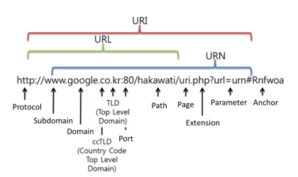

#### URI & URL

^[그림 출처: https://programming119.tistory.com/194]

##### URI (Uniform Resource Identifier)
- URI는 특정 리소스를 식별하는 **통합 자원 식별자(Uniform Resource Identifier)** 를 의미한다. 웹 기술에서 사용하는 논리적 또는 물리적 리소스를 식별하는 고유한 문자열 시퀀스다.
	-   **Uniform**은 리소스를 식별하는 통일된 방식을 말한다
	-   **Resource**란, URI로 식별이 가능한 모든 종류의 자원(웹 브라우저 파일 및 그 이외의 리소스 포함)을 지칭한다.
	-   **Identifier**는 다른 항목과 구분하기 위해 필요한 정보이다.

##### URL (Uniform Resource Locator)
- URL은 흔히 웹 **주소**라고도 하며, 컴퓨터 네트워크 상에서 리소스가 **어디 있는지 알려주기(위치)** 위한 규약이다. URI의 하위 개념이다. 

##### URI vs URL
- ==URI= 식별자, URL=식별자+위치 ==
- `elancer.co.kr`은 **URI**입니다. 리소스의 이름만 나타내기 때문이다.
-   반면, `https://elancer.co.kr`은 이름과 더불어, 어떻게 도달할 수 있는지 위치까지 함께 나타내기 때문에 **URL**이다. (프로토콜 ‘https’ 포함)

###### 참조 레퍼런스
- [URI와 URL, 어떤 차이점이 있나요? ](https://www.elancer.co.kr/blog/view?seq=74)