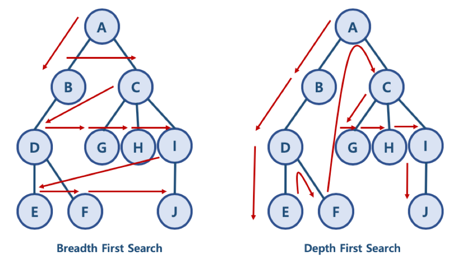
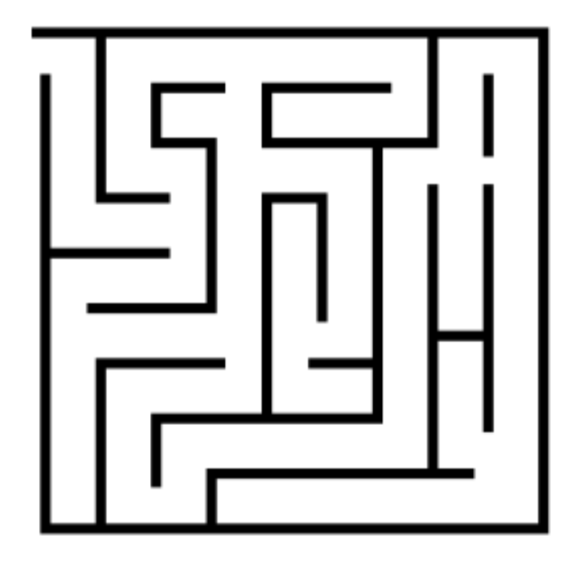

### 1. 그래프 탐색 알고리즘
- 지난 시간에 그래프 데이터 구조에 대해 학습하였다.
- 데이터 구조는 알고리즘의 재료가 되어 문제를 해결 하는데 사용된다!
	- 🥝 + 🍎 + 🍌 ⇒ 🍹
- 그렇다면 그래프 데이터 구조는 어떤 알고리즘에 활용될까? 
	- 👉 그래프 자료구조는 **탐색 알고리즘**에 활용된다!

#### 그래프 탐색 알고리즘이란? 
- 시작 정점에서 **간선을 타고 이동할 수 있는 모든 정점을 찾는** 알고리즘


- 그래프 탐색 알고리즘에는 **깊이우선탐색(DFS)** 과 **너비우선탐색(BFS)** 이 있다.
	- 이전에 학습했던 스택과 큐 자료구조의 개념을 함께 활용한다. 


#### 깊이우선탐색(DFS) vs 너비우선탐색(BFS)


### 2. 깊이 우선 탐색(DFS)
- 깊이우선탐색 (Depth First Search, DFS)
- 시작 정점으로부터 갈 수 있는 하위 정점까지 가장 깊게 탐색 하고 , 더 이상 갈 곳이 없다면 마지막 갈림길로 돌아와서 다른 정점을 탐색하며 결국 모든 정점을 방문하는 순회 방법


- 깊이 우선 탐색(DFS)은 미로 탈출로 생각하면 이해하기 쉽다
	- 👉 **어느 한 쪽 길로 가장 깊게 들어갔다가 막히면 다시 돌아와서 다른 길을 탐색** 한다!



#### 깊이 우선 탐색(DFS) 의 특징
- **모든 정점을 방문** 할 때 유리하다. 따라서 **경우의 수, 순열과 조합** 문제에서 많이 사용
한다.
- 너비우선탐색(BFS) 에 비해 코드 구현이 간단하다
	- <u>단, 모든 정점을 방문할 필요가 없거나 최단 거리를 구하는 경우에는 너비 우선 탐색(BFS)이 유리하다.</u>

### 3. DFS의 동작 과정
- DFS를 하기 전에, 일단 탐색을 진행할 그래프가 필요하다. 
	- 그래프는 **인접 행렬** 혹은 **인접 리스트** 방식으로 표현 할 수 있다. 


- **각 정점을 방문했는지 여부를 판별** 할 방문 체크 리스트가 필요하다.
	- 사람과 달리 컴퓨터는 각 정점에 방문했는지 여부를 알 수 없다.
	- 👉 따라서 <u>visited 리스트를 따로 선언하여 각 정점을 방문했는지 체크</u>한다.

```python
visited = [Faslse] * n # n은 정점의 개수
```


