```ad-note
- DFS vs BFS
	- 이론
		- DFS 이론은 👉[[05. 깊이 우선 탐색(DFS)]]
		- BFS 이론은 👉 [[08. DFS & BFS]]
	- 문제 풀이
		- DFS & BFS 기초 문제 풀이 👉 [[09. DFS 와 BFS 기초 문제 풀이]]
		- BFS 문제는 👉 [[BFS & DFS]]
```

/BFS%20&%20DFS%20실전%20문제%20풀이.md#DFS%20vs%20BFS)

## 05. 깊이 우선 탐색(DFS)


### 목차
```ad-note
- [[#1. 그래프 탐색 알고리즘|1. 그래프 탐색 알고리즘]]
	- [[#1. 그래프 탐색 알고리즘#그래프 탐색 알고리즘이란?|그래프 탐색 알고리즘이란?]]
	- [[#1. 그래프 탐색 알고리즘#깊이우선탐색(DFS) vs 너비우선탐색(BFS)|깊이우선탐색(DFS) vs 너비우선탐색(BFS)]]
- [[#2. 깊이 우선 탐색(DFS)|2. 깊이 우선 탐색(DFS)]]
	- [[#2. 깊이 우선 탐색(DFS)#깊이 우선 탐색(DFS) 의 특징|깊이 우선 탐색(DFS) 의 특징]]
- [[#3. DFS의 동작 과정|3. DFS의 동작 과정]]
- [[#4. DFS의 구현 방식|4. DFS의 구현 방식]]
	- [[#4. DFS의 구현 방식#반복문을 이용한 DFS|반복문을 이용한 DFS]]
- [[#5. DFS 문제 풀이|5. DFS 문제 풀이]]
	- [[#5. DFS 문제 풀이#단계 1. 입력 값을 받아 인접 리스트를 생성|단계 1. 입력 값을 받아 인접 리스트를 생성]]
	- [[#5. DFS 문제 풀이#단계 2. 1번 컴퓨터를 시작 정점으로 DFS 진행|단계 2. 1번 컴퓨터를 시작 정점으로 DFS 진행]]
```


### 1. 그래프 탐색 알고리즘
- 지난 시간에 그래프 데이터 구조에 대해 학습하였다.
- 데이터 구조는 알고리즘의 재료가 되어 문제를 해결 하는데 사용된다!
	- 🥝 + 🍎 + 🍌 ⇒ 🍹
- 그렇다면 그래프 데이터 구조는 어떤 알고리즘에 활용될까? 
	- 👉 그래프 자료구조는 **탐색 알고리즘**에 활용된다!

#### 그래프 탐색 알고리즘이란? 
- 시작 정점에서 **간선을 타고 이동할 수 있는 모든 정점을 찾는** 알고리즘


- 그래프 탐색 알고리즘에는 **깊이우선탐색(DFS)** 과 **너비우선탐색(BFS)** 이 있다.
	- 이전에 학습했던 스택과 큐 자료구조의 개념을 함께 활용한다. 

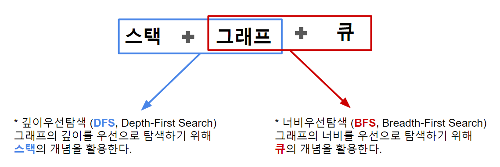

#### 깊이우선탐색(DFS) vs 너비우선탐색(BFS)
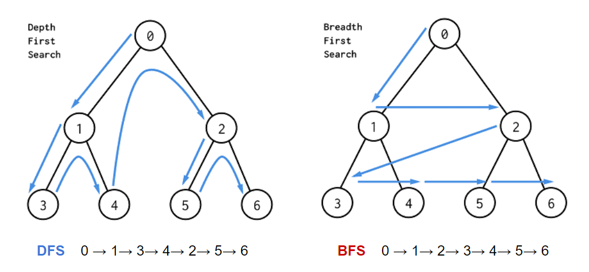


### 2. 깊이 우선 탐색(DFS)
- 깊이우선탐색 (Depth First Search, DFS)
- 시작 정점으로부터 갈 수 있는 하위 정점까지 가장 깊게 탐색 하고 , 더 이상 갈 곳이 없다면 마지막 갈림길로 돌아와서 다른 정점을 탐색하며 결국 모든 정점을 방문하는 순회 방법


- 깊이 우선 탐색(DFS)은 미로 탈출로 생각하면 이해하기 쉽다
	- 👉 **어느 한 쪽 길로 가장 깊게 들어갔다가 막히면 다시 돌아와서 다른 길을 탐색** 한다!
	- 


#### 깊이 우선 탐색(DFS) 의 특징
- **모든 정점을 방문** 할 때 유리하다. 따라서 **경우의 수, 순열과 조합** 문제에서 많이 사용
한다.
- 너비우선탐색(BFS) 에 비해 코드 구현이 간단하다
	- <u>단, 모든 정점을 방문할 필요가 없거나 최단 거리를 구하는 경우에는 너비 우선 탐색(BFS)이 유리하다.</u>

### 3. DFS의 동작 과정
- DFS를 하기 전에, 일단 탐색을 진행할 그래프가 필요하다. 
	- 그래프는 **인접 행렬** 혹은 **인접 리스트** 방식으로 표현 할 수 있다. 

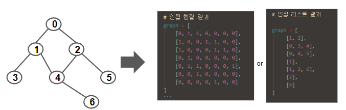

- **각 정점을 방문했는지 여부를 판별** 할 방문 체크 리스트가 필요하다.
	- 사람과 달리 컴퓨터는 각 정점에 방문했는지 여부를 알 수 없다.
	- 👉 따라서 <u>visited 리스트를 따로 선언하여 각 정점을 방문했는지 체크</u>한다.

```python
visited = [Faslse] * n # n은 정점의 개수
```

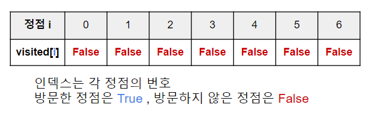

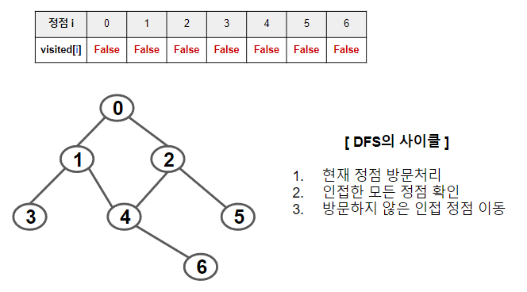

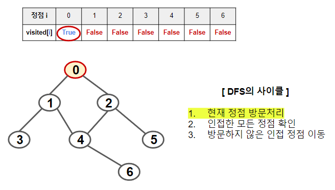

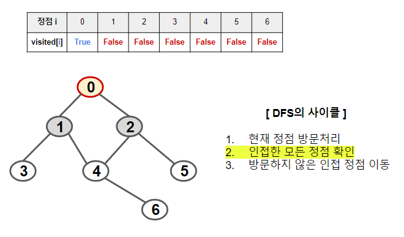

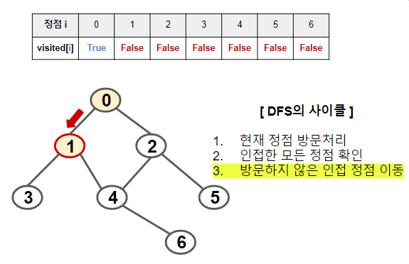

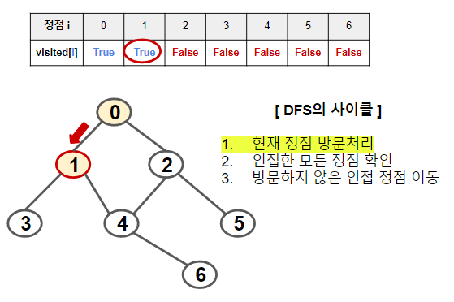

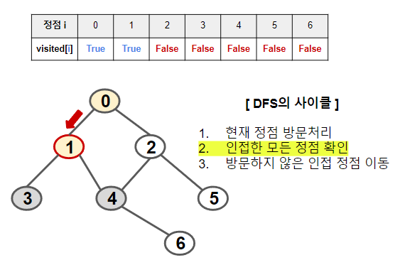

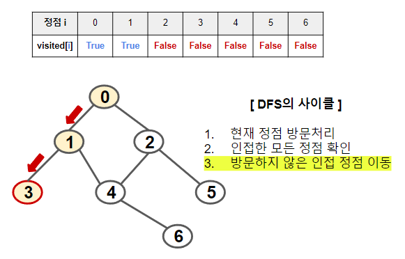

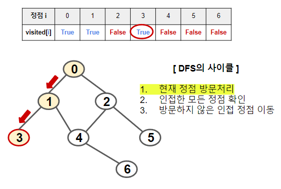

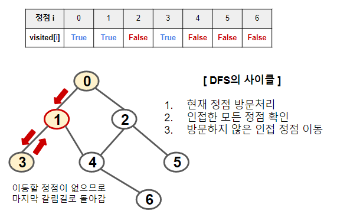

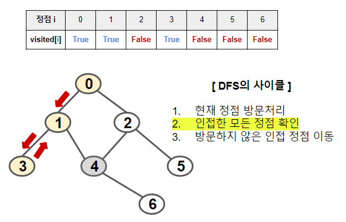

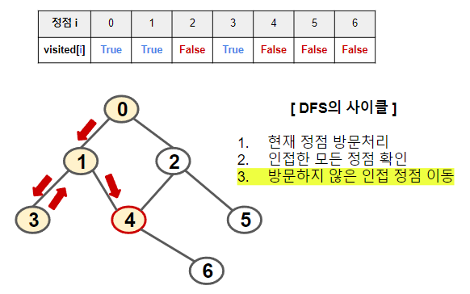

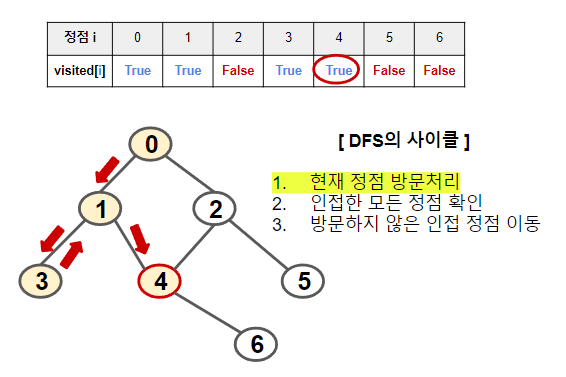

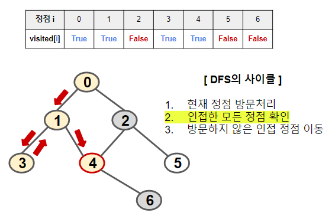

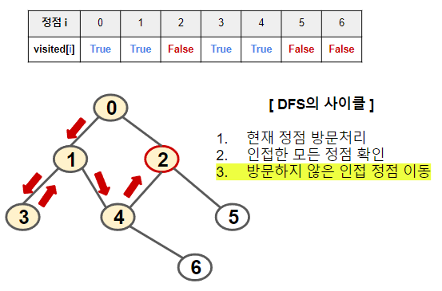

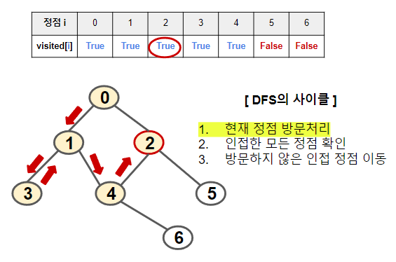

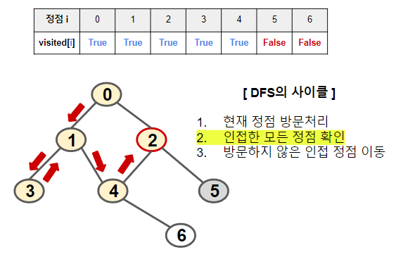

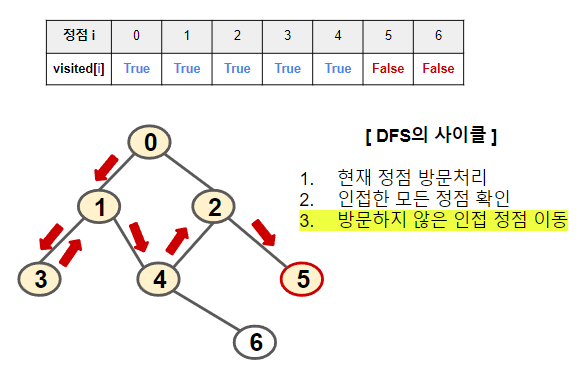

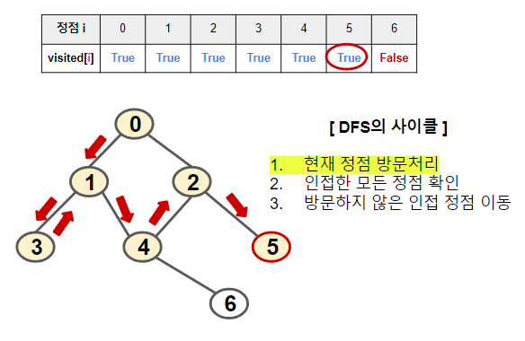

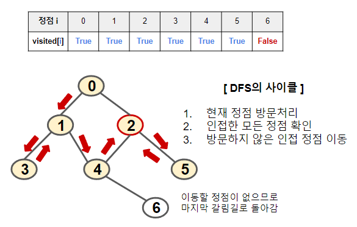

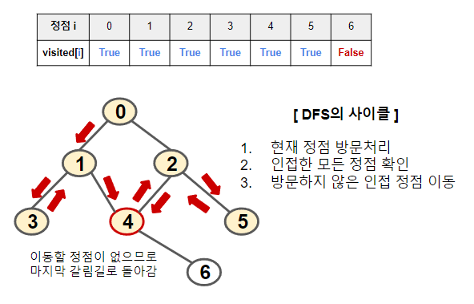

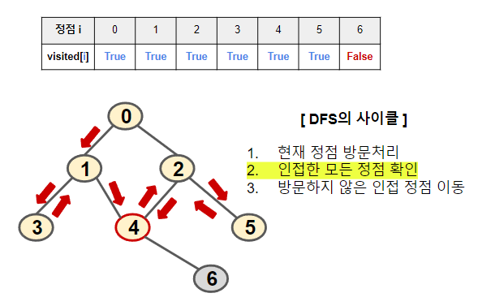

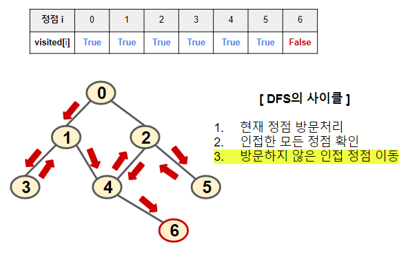

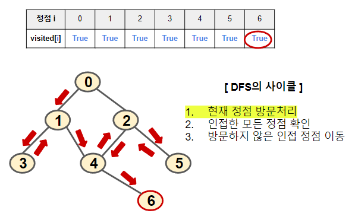

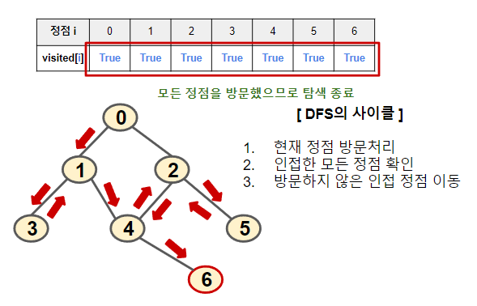

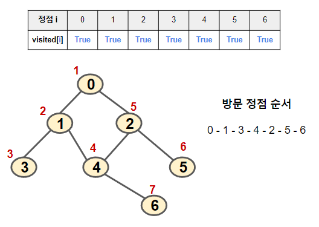


### 4. DFS의 구현 방식
- 지금까지 살펴본 DFS를 코드로 구현해보자. 여기에서는 **인접 리스트**로 표현한 그래프를 기준으로 설명한다. 

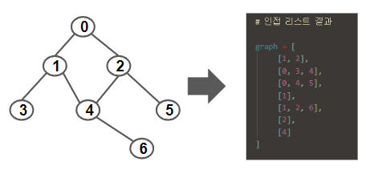

#### 재귀 방식을 이용한 DFS
- 👉 [DFS 소스코드 예제 (재귀 방식 이용)](../../Algorithm%20(theory)/08.%20DFS%20&%20BFS.md#DFS%20소스코드%20예제%20(재귀%20방식%20이용)) 코드 활용
```python
# DFS 메서드 정의
def dfs(graph, v, visited):
    # 현재 노드를 방문 처리
    visited[v] = True
    print(v, end=' ')
    # 현재 노드와 연결된 다른 노드를 재귀적으로 방문
    for i in graph[v]:
        if not visited[i]:
            dfs(graph, i, visited)

# 각 노드가 연결된 정보를 표현 (2차원 리스트)
graph = [
	[1, 2], 
	[0, 3, 4], 
	[0, 4, 5], 
	[1], 
	[1, 2, 6], 
	[2], 
[4] 
]

# 각 노드가 방문된 정보를 표현 (1차원 리스트)
visited = [False] * 7

# 정의된 DFS 함수 호출
dfs(graph, 1, visited)

# 1 0 2 4 6 5 3
```


#### 반복문을 이용한 DFS
- DFS는 직전에 방문한 정점으로 차례로 돌아가야 하므로, 후입선출(LIFO) 구조의 **스택**을 사용한다. 
```python
graph = [ 
	 [1, 2], 
	 [0, 3, 4], 
	 [0, 4, 5], 
	 [1], 
	 [1, 2, 6], 
	 [2], 
	 [4] 
 ]

visited = [False]*n # 방문 처리 리스트 만들기

def dfs(start):
	stack = [start] # 돌아갈 곳을 기록
	visited[start] = True # 시작 정점 방문 처리

	while stack: # 스택이 빌 때까지(돌아갈 곳이 없을 때까지) 반복
		cur = stack.pop() # 현재 방문 정점(후입선출)
		# print(cur)
		
		for adj in graph[cur]: # 인접한 모든 정점에 대해
			if not visited[adj]: # 아직 방문하지 않았다면
				visited[adj] = True # 방문 처리
				# print(adj)
				stack.append(adj) # 스택에 넣기

dfs(0) # 0번 정점에서 시작

# cur 0
# cur 2
# cur 5
# cur 4
# cur 6
# cur 1
# cur 3

# (start 0)
# adj 1
# adj 2
# adj 4
# adj 5
# adj 6
# adj 3
```


### 5. DFS 문제 풀이 
- 대표 예제를 통해 재귀를 이용한 DFS를 이해해보자.
	- [x] [BOJ_2606 바이러스](https://www.acmicpc.net/problem/2606) 
		- 문제를 풀지 않고, 단순히 DFS를 이용한 해결 방법만 고민해보자!


#### 단계 1. 입력 값을 받아 인접 리스트를 생성

```ad-question
- 예제 입력1
	```python
	7
	6
	1 2
	2 3
	1 5
	5 2 
	5 6
	4 7
	```
```

```python
n = int(input()) # 정점 개수(컴퓨터)
m = int(input()) # 간선 개수(네트워크)

graph = [[] for _ in range(n + 1)]
visited = [False] * (n + 1)
total = 0

# 인접 리스트 만들기
for _ in range(m):
	v1, v2 = map(int, input().split())
	graph[v1].append(v2)
	graph[v2].append(v1)
```

- 👇 "예제 입력 1" 그래프의 모습과 인접 리스트의 생성 결과 
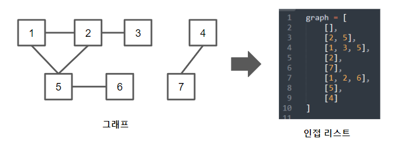

#### 단계 2. 1번 컴퓨터를 시작 정점으로 DFS 진행
- 👉 단계 2를 세분화하여 DFS의 자세한 동작 과정을 알아보자.
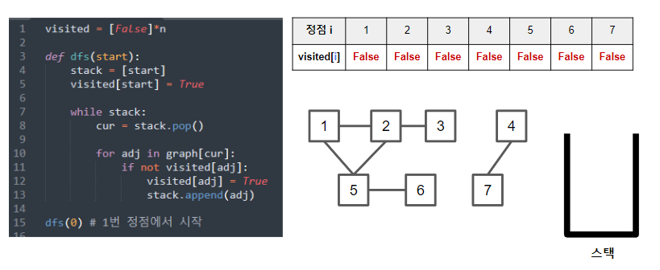

- **2-1.** dfs(1)을 호출하며 1번 컴퓨터에서 DFS 시작
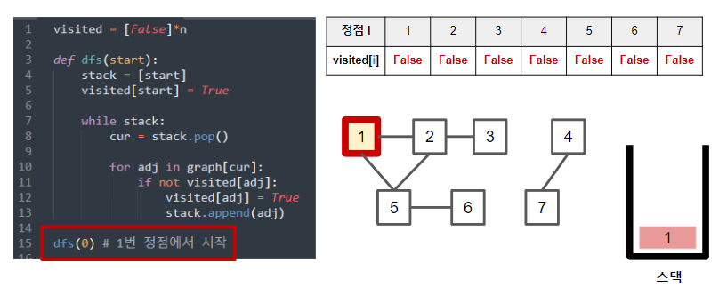

- **2-2.** 1번 컴퓨터 방문처리
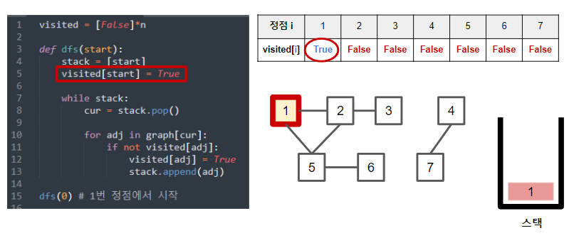

- **2-3.** 1번 컴퓨터와 인접한 컴퓨터 중 아직 방문하지 않은 곳 조회
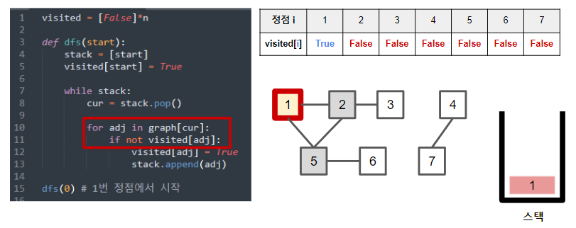

- **2-4.** 2번 컴퓨터로 이동
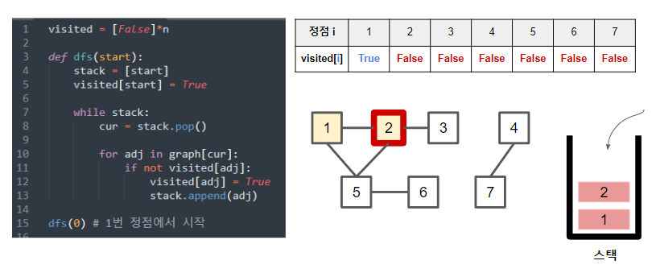

- **2-5.** 2번 컴퓨터 방문 처리
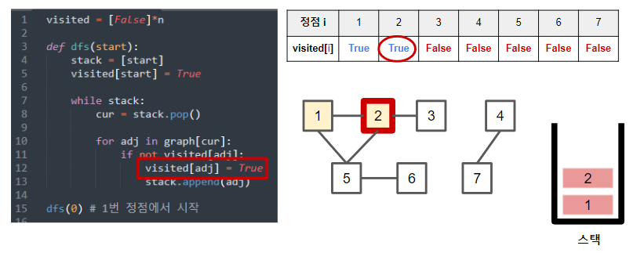

- **2-6.** 2번 컴퓨터와 인접한 컴퓨터 중 아직 방문하지 않은 곳 조회
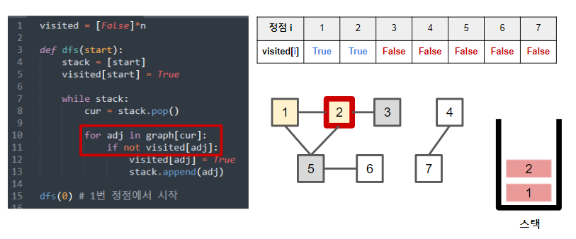

- **2-7.** 3번 컴퓨터로 이동
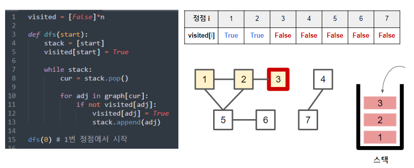

- **2-8.** 3번 컴퓨터 방문처리
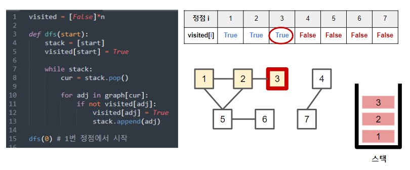

- **2-9.** 3번 컴퓨터와 인접한 컴퓨터 중 아직 방문하지 않은 곳 조회
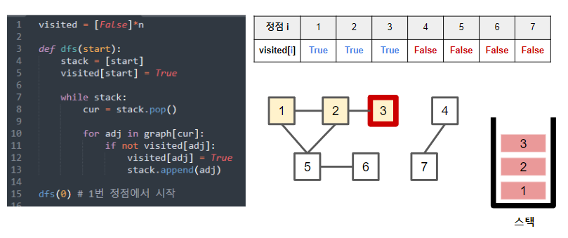

- **2-10.** 3번 컴퓨터에서 갈 곳이 없으므로 이전 정점으로 돌아감
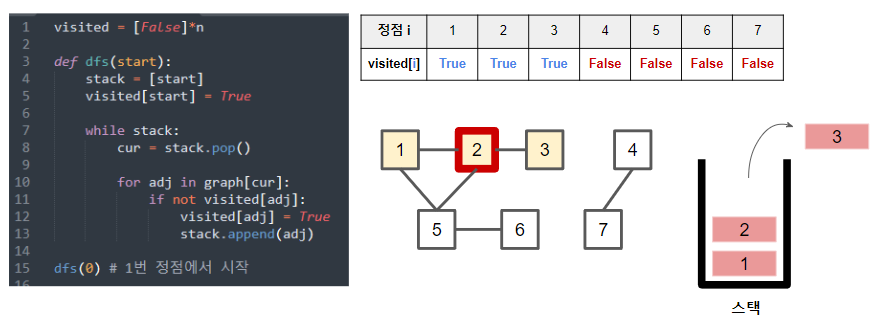

- **2-11.** 방문하지 않은 인접 컴퓨터 조회
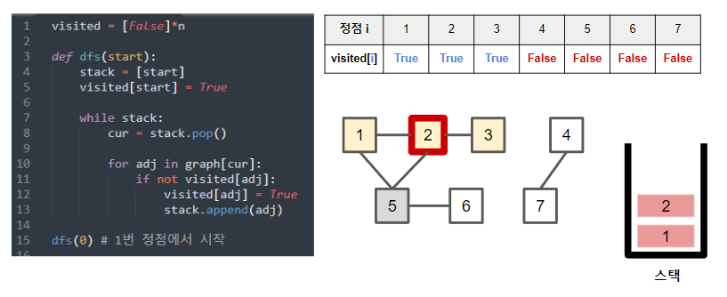

- **2-12.** 5번 컴퓨터로 이동
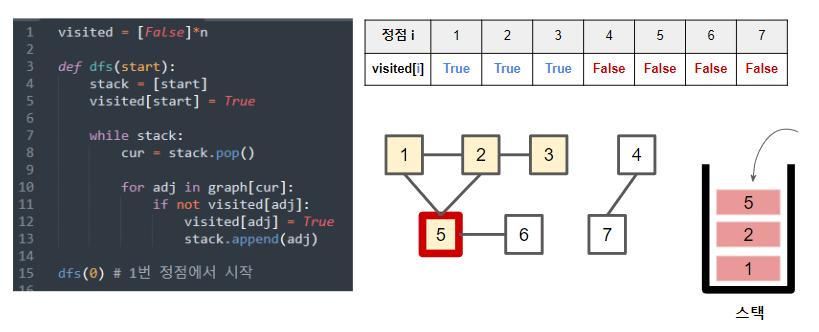

- **2-13.** 5번 컴퓨터 방문처리
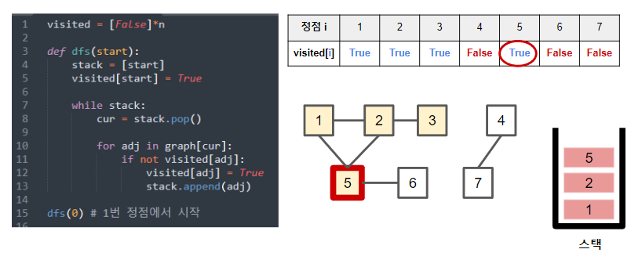

- **2-14.** 5번 컴퓨터와 인접한 컴퓨터 중 아직 방문하지 않은 곳 조회
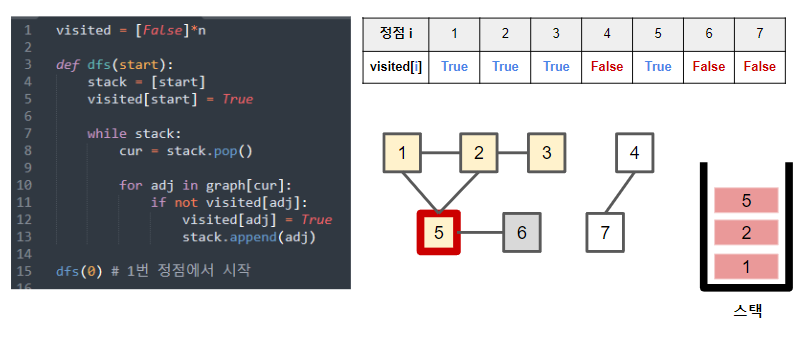

- **2-15.** 6번 컴퓨터로 이동
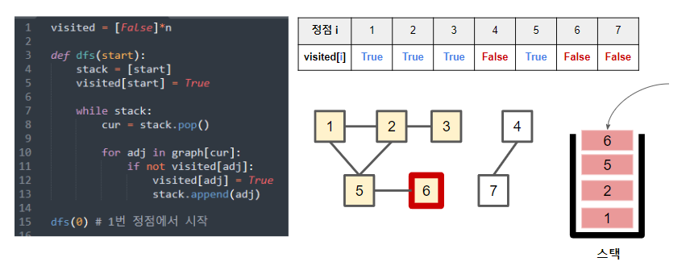

- **2-16.** 6번 컴퓨터 방문처리
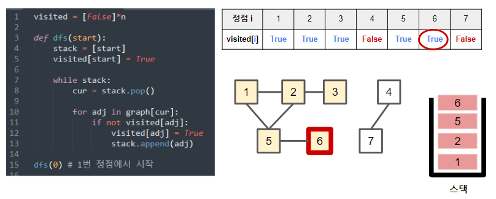

- **2-17.** 6번 컴퓨터와 인접한 컴퓨터 중 아직 방문하지 않은 곳 조회
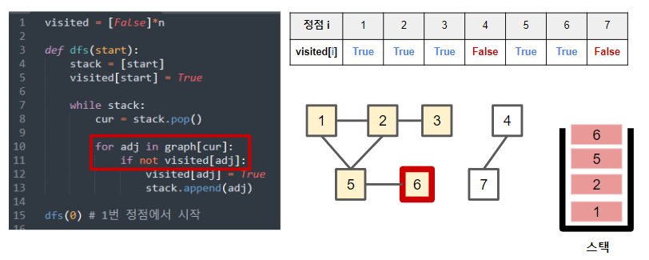

- **2-18.** 6번 컴퓨터에서 갈 곳이 없으므로 이전 정점으로 돌아감
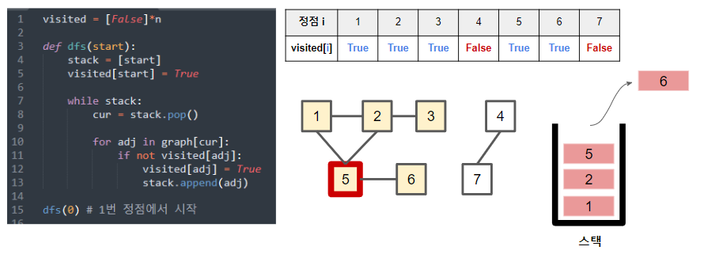


- **2-19.** 5번 컴퓨터에서 갈 곳이 없으므로 이전 정점으로 돌아감
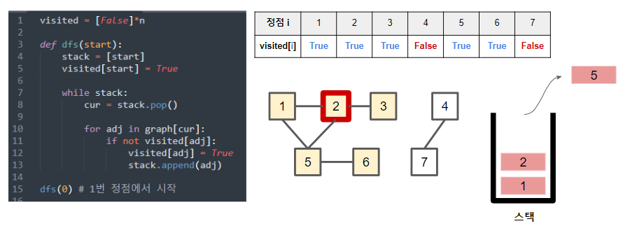

* **2-20.** 2번 컴퓨터에서 갈 곳이 없으므로 이전 정점으로 돌아감
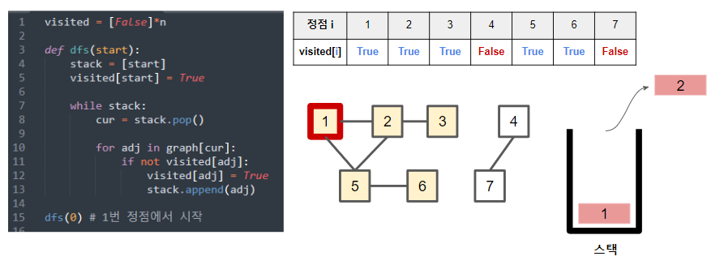

- **2-21.** 1번 컴퓨터에서 갈 곳이 없으므로 dfs(1)이 종료되고 탐색 종료
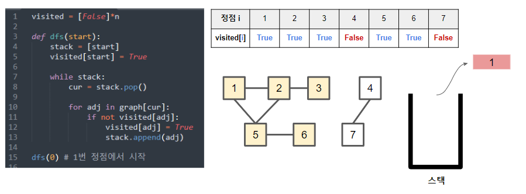

- **2-22.**  최종적으로 1번 컴퓨터에 의해 감염되는 컴퓨터는 2, 3, 5, 6 **(총 4대)**
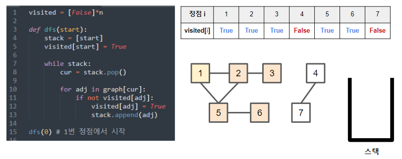