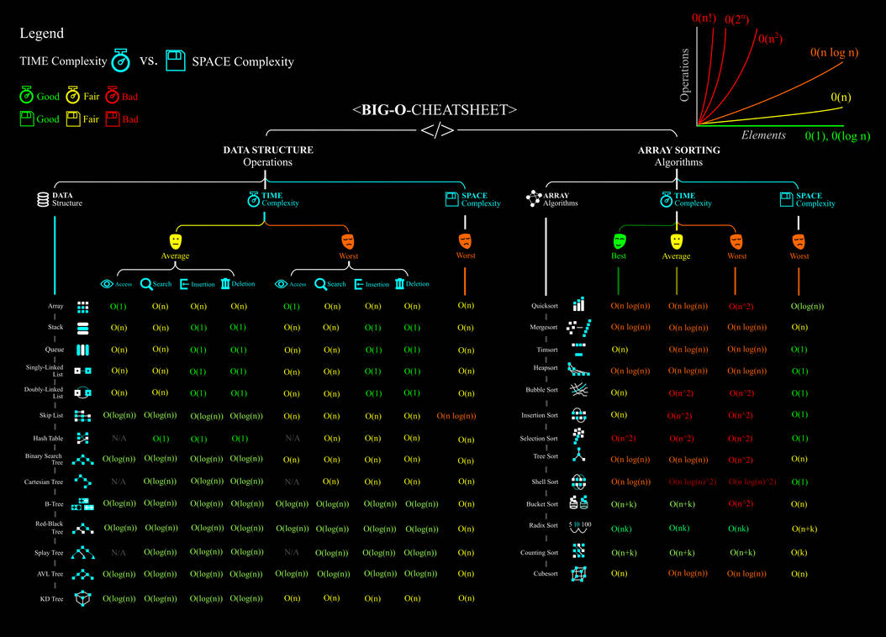

## 03. 시간 복잡도 & 빅오 표기법

### 1. 알고리즘의 시간 복잡도
#### 좋은 알고리즘이란 무엇일까? 
- 👉 효율성이 좋은 알고리즘?
- 👉 성능이 좋은 알고리즘? 
- 👉 Input을 넣은 후 Output이 나오는 **시간이 짧은** 알고리즘 !

#### 알고리즘의 소요시간 측정하기1 

- 같은 알고리즘인데 측정 시간이 다르다? 
	- 👉개개인의 컴퓨팅 환경에 따라 ==같은 알고리즘이라도 측정시간이다르다. ==
	- 👉 환경에 영향을 받지 않는 **객관적인 기준**이 필요하다. 


#### 알고리즘의 소요시간 측정하기2 


```python
def count(word, char): 
	total = 0
	
	for i in word: 
		if i == char: 
			total += 1
			
	return total
```

- 기본연산 : 단위 시간 ` 1 ` 이 소요되는 시간 
	- ex) 할당, 산술, 비교, 반환 $\cdots$
- ***기본 연산의 총 횟수 == 알고리즘의 총 소요 시간***  


```ad-question
	```python
	count("apple", "p") 
	# 2
	```
- 위와 같은 상황에서 몇 번의 기본연산이 일어날까? **(== 알고리즘의 소요시간이 몇일까?)**
```


- 👉 기본연산의 횟수를 구하는 것은 환경에 영향을 받지 않는 객관적인 방법이지만, **입력의 개수**에 따라 시간이 달라진다는 문제가 있다. 
	- `"appleapple"` 이라면? 
	- `"abcdefghijklmnopqrstuvwxyz"` 이라면?

- 👉 따라서 성능을 측정할 때는 **입력을 통일**시킨다. 
	- 가장 기본연산이 많이 일어나는 **최악의 입력 n개**가 들어온다고 가정한다. (매 반복 마다 `total += 1` 연산 실행 하는 경우)


#### 시간 복잡도(Time Complexity)
- ~~계산 복잡도 이론에서 시간 복잡도는 문제를 해결하는데 걸리는 시간과 입력의 함수 관계를 가리킨다.~~
- 단순하게 ==알고리즘의 수행시간==을 의미한다?
	- 시간 복잡도가 높다 → 느린 알고리즘
	- 시간 복잡도가 낮다 → 빠른 알고리즘

#### 시간 복잡도에 따라 알고리즘 성능을 비교해 보자 


### 2. 빅오(Big-O) 표기법
- 빅오(Big-O) 표기법이란?


- 👉 입력 n이 **무한대**로 커진다고 가정하고 시간 복잡도를 간단하게 표시하는 것
	 ==**최고차항**만 남기고 계수와 상수 제거 👇
	

- 매 입력에 따라 정확한 수식을 구하는 것은 불필요하다. 
	- 정확한 수치보다는 **증가율**에 초점을 맞춘다.


- 👉따라서 원래 둘의 소요시간은 2배 차이가 났지만 점근적 표기법에 의해 <u>동일한 시간 복잡도</u>를 나타냄


- 참고자료: https://wiki.python.org/moin/TimeComplexity
%20&%20빅오%20표기법%20(Big%20O%20notation).png)

| 표기 | 내용 |예시 |
| :---: | ---------------------------------------------- | --------------------------------------------------- |
| $O(1)$    | 단순 산술 계산<br>(덧셈, 뺄셈, 곱셉, 나눗셈) | 단순계산 → a + b, 100 * 200                        |
| $O(logN)$    | 크기 N인 리스트를 <br>반절씩 순회/탐색    | 이진탐색(Binary Search), <br>분할정복(Divide & Conquer) |
| $O(N)$    | 크기 N인 리스트를 순회                   | 리스트 순회, 1중 for 문                             |
| $O(NlogN)$    |크기 N인 리스트를 <br>반절씩 탐색 * 순회 | 높은 성능의 정렬<br>(Merge/Quick/Heap Sort)             |
| $O(N^2)$ 또는 O(N^2)  |크기 M, N인 2중 리스트를 순회          | 2중 리스트 순회, 2중 for 문                         |
| $O(N^3)$ 또는 O(N^3)|3중 리스트를 순회                      | 3중 리스트 순회, 3중 for 문                         |
| $O(2^N)$ 또는 O(2^N) | 크기 N 집합의 부분 집합                | 크기가 N인 집합의 부분 집합                         |
| $O(N!)$    | 크기 N 리스트의 순열                    | 크기가 N인 순열                                     |

#### 실제 문제에서 어떻게 적용해 볼 수 있을까? 
- [ ] [BOJ_4344 평균은 넘겠지](https://www.acmicpc.net/problem/4344)


- 실제 문제는 “초” 단위로 제한 시간이 주어지고 시간 복잡도도 정확하게 예측하기가 어렵다. 
- 따라서 어림짐작을 하는 방법을 알아야한다. 
- 보통 **1초에 1억 번** 연산으로 계산을 한다. 
- 입력의 개수에 따라 반복문을 몇 중으로 순회할 수 있는지 파악해야 한다

```ad-question
- 가령, 아래와 같은 문제를 푼다고 가정해 보자

```

- 일단은 코드 짜는데 집중! 그리고 나서 수정!

1) 첫번째 방법 - 1부터 n까지 일일히 더하기 
```python
def get_total(n): 
	total = 0 
	
	for i in range(1, n + 1): 
		total += i 
	return total 
	
print(get_total(10))
# 55 
print(get_total(1000000000))
# 제한 시간 1초 초과
```

2) 두번째 방법 - 가우스의 합 공식
```python
def get_total(n): 
	return (n * (n + 1)) // 2 
	
print(get_total(10)) 
# 55 
print(get_total(1000000000))
# 500000000500000000
```


- 👉 같은 Output을 만드는 알고리즘이라도, 시간 복잡도에 따라 **성능**이 달라질 수 있고 시험에서 **정답 여부**가 갈리는 포인트가 된다는 것이다.

- ***내장 함수, 메서드의 시간 복잡도도 확인할 필요가 있다.***

- 참고 : [Complexity of Python Operations](https://www.ics.uci.edu/~pattis/ICS-33/lectures/complexitypython.txt)
- 가끔 **for문을 1번만 썼는데 왜 시간초과가 날까요?** 라고 질문하는 사람들이 있다. for문이 1번이라고 해서 무조건 O(n)인 것은 아니다. for문 안에 O(n)의 내장 함수를 사용했다면 사실상 **이중 for문**과 다를 것이 없기 때문이다.



- 참고: [Big O Notation Cheat Sheet by Assyrianic on DeviantArt](https://www.deviantart.com/assyrianic/art/Big-O-Notation-Cheat-Sheet-762169573)