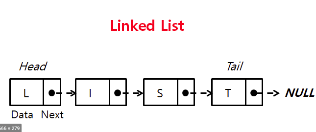
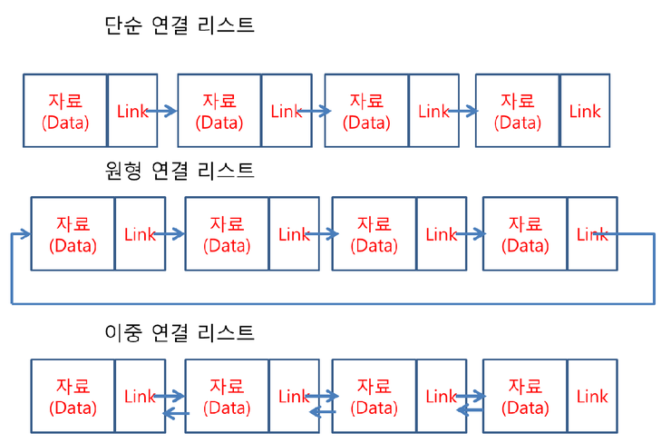
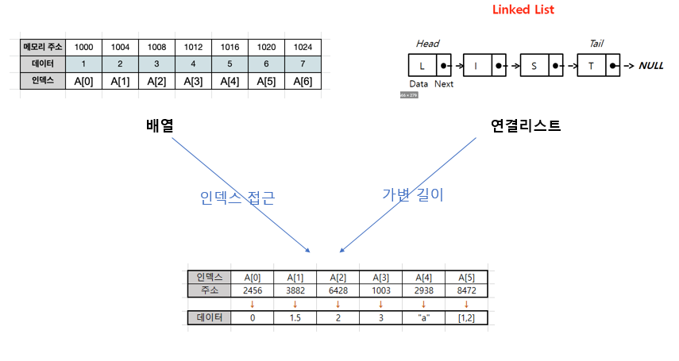
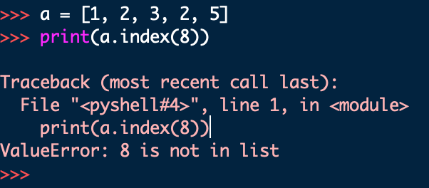
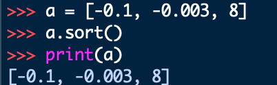

## 04. 리스트 (List)

#### 1. 배열 vs 연결리스트 

1. 배열 (Array)
	- ***여러 데이터들이 연속된 메모리 공간에 저장되어 있는 자료구조***
	- 인덱스(index)를 통해 데이터에 빠르게 접근
	- 배열의 길이는 변경 불가능 → 길이를 변경하고 싶다면 새로 생성
	- 데이터 타입은 고정


```c
// C 언어에서의 배열 선언
int arr[5] = {70, 80, 20, 100, 90};
```


2. 연결리스트 (Linked List)
	- ***데이터가 담긴 여러 노드들이 순차적으로 연결된 형태의 자료구조***
	- 맨 처음 노드부터 순차적으로 탐색
	- 연결리스트의 길이 자유롭게 변경 가능 → 삽입, 삭제가 편리
	- 다양한 데이터 타입 저장
	- 데이터가 메모리에 연속적으로 저장되지 않음





- 파이썬의 리스트는 배열 & 연결 리스트의 특징을 혼합해서 만들어짐.


---

#### 2. 파이썬의 리스트
```
1) .append()
2) .pop()
3) .count()
4) .index()
5) .sort()
6) .reverse()
```

##### 1) .append(원소)
- 리스트의 맨 끝에 새로운 원소 삽입
```python

a = [1, 2, 3, 4, 5]
a.append(6)
print(a)
>>> [1, 2, 3, 4, 5, 6]

#################################

a = [1, 2, 3, 4, 5]
a.append(["a", "b"])
print(a)
>>> [1, 2, 3, 4, 5, ['a', 'b']]

```


##### 2) .pop(인덱스)
- 특정 인덱스에 있는 원소를 ***삭제 및 반환***

```python

a = [1, 2, 3, 4, 5]
b = a.pop() 
[[인덱스가]] 없으면 가장 마지막에 있는 수

print(a)
print(b)
>>> [1, 2, 3, 4]
>>> 5

#################################

a = [1, 2, 3, 4, 5]
b = a.pop(2)

print(a)
print(b)
>>> [1, 2, 4, 5]
>>> 3

```

##### 3) .count(원소)
- 리스트에서 해당 원소의 ***개수***를 반환
```python
a = [1, 2, 2, 3, 3, 3]

print(a.count(2))
>>>2

#################################

a = [1, 2, 2, 3, 3, 3]

print(a.count(3))
>>>3
```

##### 4) .index(원소)
- 리스트에서 처음으로 원소가 등장하는 인덱스 반환

```python

a = [1, 2, 3, 2, 5]
print(a.index(2))
>>> 1
```

```python
a = [1, 2, 3, 2, 5]
print(a.index(8))
```



	➡️ 리스트에 없는 요소를 찾을 경우 에러 발생

##### 5) .sort()
- 리스트를 오름차순으로 ***정렬***
- `reverse=True` 옵션을 통해 내림차순으로 정렬 가능 (기본값이 오름차순)

```python

a = [5, 2, 4, 0, -1]
a.sort()
print(a)
>>> [-1, 0, 2, 4, 5]

#################################

a = [5, 2, 4, 0, -1]
a.sort(reverse=True)
print(a)
>>> [5, 4, 2, 0, -1]

```



##### 6) .reverse()
- 리스트의 원소들의 순서를 거꾸로 ***뒤집기***
```python

a = [1, 2, 3, 4, 5]
a.reverse()
print(a)
>>> [5, 4, 3, 2, 1]
```

#### 자주 쓰이는 리스트 관련 내장 함수
```
1) len()
2) sum()
3) max()
4) min()
5) sorted()
6) reversed()
```

##### 1) len(iterable)
- 리스트의 ***길이***(원소의 개수)를 반환
```python

a = [1, 2, 3, 4, 5]

print(len(a))
>>> 5
```

##### 2) sum(iterable)
- 리스트의 모든 원소의 ***합***을 반환
```python

a = [1, 2, 3, 4, 5]

print(sum(a))
>>> 15
```

##### 3) max(iterable)
- 리스트의 원소 중 ***최대값***을 반환
```python
a = [1, 2, 3, 4, 5]

print(max(a))
>>> 5

```

##### 4) min(iterable)
- 리스트의 원소 중 ***최소값***을 반환
```python
a = [1, 2, 3, 4, 5]

print(min(a))
>>> 1

```


##### 5) sorted(iterable)
- 오름차순으로 ***정렬***된 새로운 리스트 반환
- 원본 리스트는 변화 없음
```python
a = [5, 2, -1, 0, 1]
b = sorted(a)
c = sorted(a, reverse=True)

print(a) # 원본
print(b) # 오름차순 정렬 
print(c) # 내림차순 정렬
>>>[5, 2, -1, 0, 1]
>>>[-1, 0, 1, 2, 5]
>>>[5, 2, 1, 0, -1]

```

##### 5) reversed(iterable)
- 리스트의 순서를 거꾸로 ***뒤집은*** 새로운 객체 반환
- 원본 리스트는 변화 없음

```python
a = [1, 2, 3, 4, 5]
b = reversed(a)
c = list(reversed(a))

print(a) # 원본
print(b) # reversed(a) 
print(c) # list(reversed(a))
>>>[1, 2, 3, 4, 5]
>>><list_reverseiterator object at 0x0000023605E231F0>
>>>[5, 4, 3, 2, 1]
```

- 리스트 관련 내장함수 연습
	- [x] [최소, 최대](https://www.acmicpc.net/problem/10818) 
	- [x] [숫자의 합](https://www.acmicpc.net/problem/11720) 
	- [X] [수 정렬하기](https://www.acmicpc.net/problem/2750)


### 3. 리스트 컴프리헨션 (List Comprehension)
- List Comprehension(리스트 컴프리헨션, 리스트 내포)란 코드 ***한 줄*** 만으로 새로운 리스트를 만드는 방법이다. 

```python 
numbers = []
for i in range(5):
	numvers.append(i)

print(numbers)
>>> [0, 1, 2, 3, 4]

#########################

numbers = [i for i in range(5)]
print(numbers)

>>> [0, 1, 2, 3, 4]

```

- if 문으로 필터링도 가능
```python

odd_numbers = [i for i in range(10) if i % 2 == 1]
print(odd_numbers)
>>> [1, 3, 5, 7, 9]
```


- 리스트 컴프리헨션 연습
	- [x] [문제1. 자기주도 파이썬- 리스트 3 - 자가진단 1](http://www.jungol.co.kr/bbs/board.php?bo_table=pbank&wr_id=4348&sca=pyc0)
	- [x] [문제2. 자기주도 파이썬- 리스트 3 - 형성평가 1](http://www.jungol.co.kr/bbs/board.php?bo_table=pbank&wr_id=4356&sca=pyc0)
	- [x] [2562번: 최댓값 (acmicpc.net)](https://www.acmicpc.net/problem/2562)

```python
[[문제]] 1 
num = int(input())

num_list = [i*i for i in range(num+1) ]
print(num_list)

################################################

[[문제]] 2
num = int(input())

num_list = ["No.{i}" for i in range(num+1) ]
print(num_list)


################################################

# BOJ_2562
## 리스트 컴프리헨션을 이용한 코드
data = [int(input()) for _ in range(9)]

print(max(data))
print(data.index(max(data))+1)
```