## 문자열 (String)

### 목차
```ad-note
- [[#들어가기 전에|들어가기 전에]]
- [[#1. 문자열 슬라이싱|1. 문자열 슬라이싱]]
- [[#1. 문자열 슬라이싱#2. 문자열 메서드|2. 문자열 메서드]]
	- [[#2. 문자열 메서드#1) .split(기준 문자)|1) .split(기준 문자)]]
	- [[#2. 문자열 메서드#2) .strip(제거할 문자)|2) .strip(제거할 문자)]]
	- [[#2. 문자열 메서드#3) .find(찾는 문자)|3) .find(찾는 문자)]]
	- [[#2. 문자열 메서드#3) .index(찾는 문자)|3) .index(찾는 문자)]]
	- [[#2. 문자열 메서드#5) .count(개수를 셀 문자)|5) .count(개수를 셀 문자)]]
	- [[#2. 문자열 메서드#6) .replace(기존 문자, 새로운 문자)|6) .replace(기존 문자, 새로운 문자)]]
	- [[#2. 문자열 메서드#7) 삽입할 문자.join(iterable)|7) 삽입할 문자.join(iterable)]]
- [[#3. 아스키(ASCII) 코드|3. 아스키(ASCII) 코드]]
- [[#3. 아스키(ASCII) 코드#1) ord(문자)|1) ord(문자)]]
- [[#3. 아스키(ASCII) 코드#1) chr(아스키코드)|1) chr(아스키코드)]]
```


#### 들어가기 전에 
- 문자열은 ***immutable***(변경 불가능한) 자료형!
```python

word = "apple"
print(word)
print(id(word)) # 기존 word 변수
>>> apple
>>> 1352749370800

word += "banana" 
print(word) 
print(id(word)) # 바뀐 word 변수
>>> apple banana 
>>> 1352749417520
```

- 💡 기존 word 변수와 바뀐 word 변수의 id가 다르다.
	→ 겉보기에 이름만 같지, 사실은 다른 변수이다. 

- id() → 주소같은 것이 바뀌는 것
- 기존의 “apple” 은 지칭하는 변수가 없으므로, 자동으로 없어짐(자바의 가비지 컬렉터 같은 느낌) ⇔ C언어는 malloc 으로 직접 삭제해 줘야 함

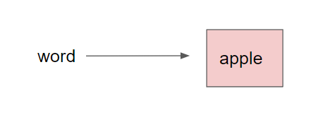

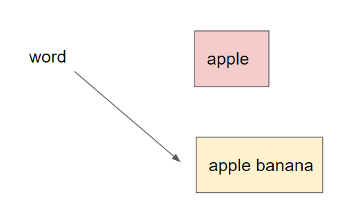


### 1. 문자열 슬라이싱

^cf4e34

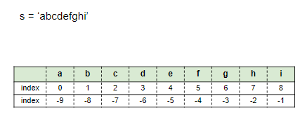

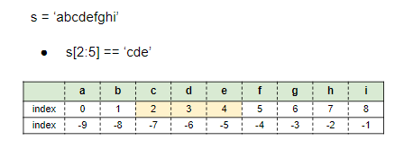

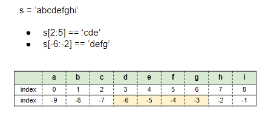
- `s[(len(s) -6):-2]` 는 `s[3:2]` 과 동일 (절대값 더해줌)

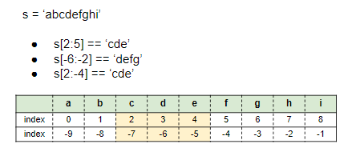

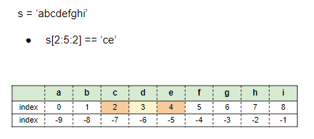

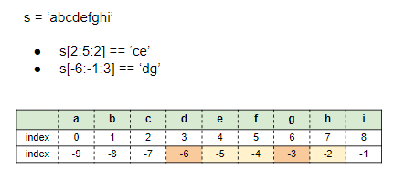

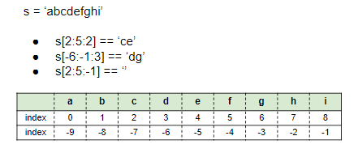

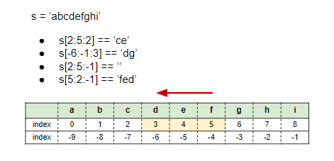
- 3번 → 해외여행시 가는날이 오는 날 보다 느린 경우
	- s[2] → s[5] 방향성은 → (순방향) 
	- -1 은 ← (역방)

```python
str = "hello"

print(str[:5]) # hello
print(str[0:4]) # hell
print(str[4:0]) # 
print(str[0:4:-1]) #
# 이때, 3,4 번은 출력 안 되는 게 맞음
print(str[4:0:-1]) # olle
```

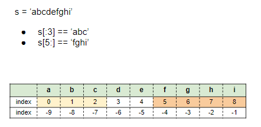

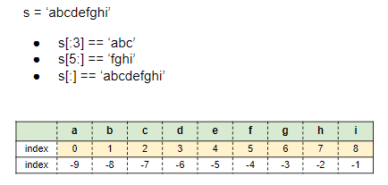

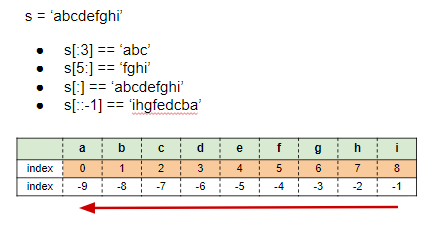

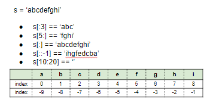

- 문자열 슬라이싱 연습
	- [ ] [BOJ_10988 팰린드롬인지 확인하기](https://www.acmicpc.net/problem/10988) #todo

### 2. 문자열 메서드
```ad-note
- [[#1) .split(기준 문자)|1) .split(기준 문자)]]
- [[#2) .strip(제거할 문자)|2) .strip(제거할 문자)]]
- [[#3) .find(찾는 문자)|3) .find(찾는 문자)]]
- [[#3) .index(찾는 문자)|3) .index(찾는 문자)]]
- [[#5) .count(개수를 셀 문자)|5) .count(개수를 셀 문자)]]
- [[#6) .replace(기존 문자, 새로운 문자)|6) .replace(기존 문자, 새로운 문자)]]
- [[#7) 삽입할 문자.join(iterable)|7) 삽입할 문자.join(iterable)]]
```


```
1) .split()
2) .strip()
3) .find()
4) .index()
5) .count()
6) .replace()
7) .join()
```

##### 1) .split(기준 문자)
- 문자열을 일정 **기준**으로 나누어 **리스트로 반환**
- 괄호 안에 아무것도 넣지 않으면 자동으로 공백을 기준으로 설정

```python
word = 'I play the piano'
print(word.split())
>>> ['I', 'play', 'the', 'piano']

###############################################

word = "apple,banana,orange,grape"
print(word.split(","))
>>> ['apple', 'banana', 'orange', 'grape']

###############################################

word = "This_is_snake_case"
print(word.split("_"))
>>> ['This', 'is', 'snake', 'case']
```


##### 2) .strip(제거할 문자)
- 문자열의 **양쪽** 끝에 있는 특정 문자를 모두 **제거**한 새로운 문자열 반환
- 괄호 안에 아무것도 넣지 않으면 자동으로 공백을 제거 문자로 설정
- 제거할 문자를 여러개 넣으면 해당하는 모든 문자들을 제거
	-  strip → 원본이 변하지 않는다!

```python
word = " Hello World "
print(word.strip())
>>> Hello World

##########################

word = "@Hello World@"
print(word.strip("@"))
>>> Hello World

##########################

word = "Hello World"
print(word.strip("Hd"))
>>> ello Worl

##########################

word = "Hello Worldddddd"
print(word.strip("d"))
>>> Hello Worl
```

##### 3) .find(찾는 문자)
- 특정 문자가 처음으로 나타나는 **위치(인덱스)** 를 반환 
- 찾는 문자가 없다면 **-1** 을 반환

```python
word = "apple"
print(word.find("p"))
>>> 1

#########################

word = "apple"
print(word.find("k"))
>>> -1
```

```ad-tip
- `.find` 와 `.index` 차이
	- ***출력값이 달라요! X***
	- 해당 값이 없으면 중단되냐 아니냐.
	```python
	# find의 경우
	str = "apple"
	print(str.find("f"))
	print("Done")
    >>> -1
	Done
	
	#########################################
	# 인덱스의 경우
	str = "apple"
	print(str.index("f"))
	print("Done")
	>>> error!
```

##### 3) .index(찾는 문자)
- 특정 문자가 처음으로 나타나는 **위치(인덱스)** 를 반환 
- 찾는 문자가 없다면 ***오류*** 발생

```python
word = "apple"
print(word.index("p"))
>>> 1

#########################

word = "apple"
print(word.index("k"))
```

- 오류 발생
	- 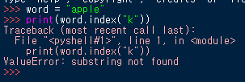

##### 5) .count(개수를 셀 문자)
- 문자열에서 특정 문자가 **몇 개**인지 반환
- 문자 뿐만 아니라, 문자열의 개수도 확인 가능

```python
word = "banana"
print(word.count("a"))
>>> 3

##########################

word = "banana"
print(word.count("na"))
>>> 2

##########################

word = "banana"
print(word.count("ana"))
>>> 1
```


##### 6) .replace(기존 문자, 새로운 문자)
- 문자열에서 기존 문자를 새로운 문자로 **수정**한 새로운 문자열 반환
- 특정 문자를 빈 문자열(`""`)로 수정하여 마치 해당 문자를 삭제한 것과 같은 효과 가능
- ==replace를 반환 이후에도 활용하려면 반환값을 저장해야한다!== (예시2번)

```python
word = "happyhacking"
print(word.replace("happy", "angry"))
>>> angryhacking

########################################

word = "happyhacking"
print(word.replace("h", "H"))
>>> HappyHacking
print(word)
>>> "happyhacking"

########################################

>>word = "happyhacking"
print(word.replace("happy", ""))
>>> hacking
```


##### 7) 삽입할 문자.join(iterable)
- ***iterable*** 의 **각각 원소 사이에 특정 문자를 삽입**한 새로운 문자열 반환
- 공백 출력, 콤마 출력 등 원하는 **출력** 형태를 위해 사용

```python
word = "happyhacking"
print(" ".join(word))
>>> h a p p y h a c k i n g

###############################

word = "happyhacking"
print(",".join(word))
>>> h,a,p,p,y,h,a,c,k,i,n,g

###############################

word = ["edu", "hphk.kr"]
print("@".join(word))
>>> edu@hphk.kr

###############################

words = ["h","a","p","p","y"]
print("".join(words))
>>> happy
```

- 문자열 메서드 연습
- [x] [BOJ_17249 태보태보 총난타](https://www.acmicpc.net/problem/17249)


### 3. 아스키(ASCII) 코드
- 컴퓨터는 숫자만 이해할 수 있다!

| 비트(bit) | 바이트(byte) |
| --- | --- |
					| 0과 1 두가지 정보만 표현 | 데이터를 저장하는 기본 단위, 1 byte == 8 bits |
|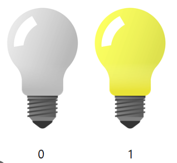    |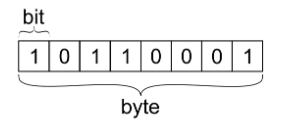   |

- ***그렇다면 문자는 어떻게 저장될까?***
	-  ASCII (American Standard Code for Information Interchange)
	- 미국 정보교환 표준부호

- 아스키(ASCII) 코드란?
	- 알파벳을 표현하는 대표 인코딩 방식
	- 각 문자를 표현하는데 1byte (8 bits) 사용
		- 1bit : 통신 에러 검출용
		- 7bit : 문자 정보 저장 (총 128개)
- 
- 
- 💡 키보드 자판을 누르면, 해당 자판(가령 `A`)에 매핑된 `아스키 코드 65` 가 입력된다!

#### 1) ord(문자)
- **문자 → 아스키코드**로 변환하는 내장함수
- 📌ASCII 코드 상에서 각 알파벳 대문자(`A`)와 소문자(`a`)는 `32` 차이가 난다!
```python
print(ord("A"))
>>> 65

print(ord("a"))
>>> 97
```


#### 1) chr(아스키코드)
- **아스키코드 → 문자**로 변환하는 내장함수
- 📌ASCII 코드 상에서 각 알파벳 대문자(`A`)와 소문자(`a`)는 `32` 차이가 난다!
```python
print(chr(65))
>>> A

print(chr(97))
>>> a
```

- 아스키(ASCII) 코드 연습
	- [ ] [BOJ_10809 알파벳 찾기](https://www.acmicpc.net/problem/10809) #todo
- [ ] [BOJ_1893 시저암호](https://www.acmicpc.net/problem/1893) #todo