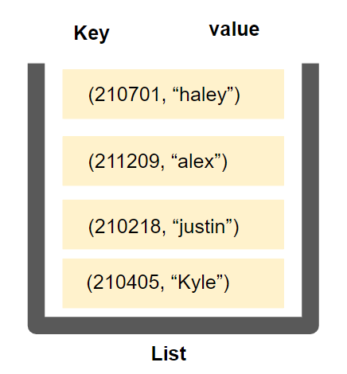
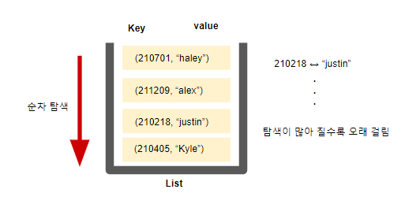
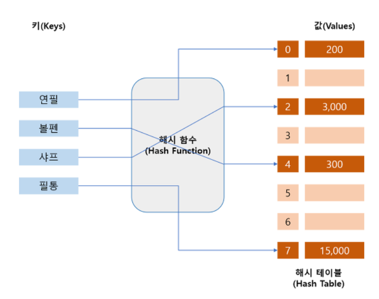
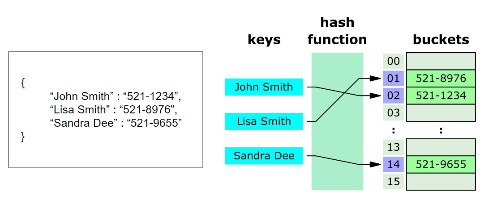
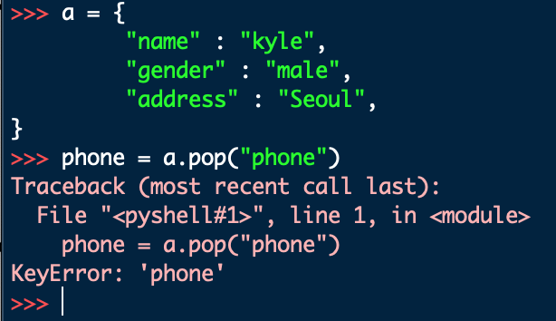
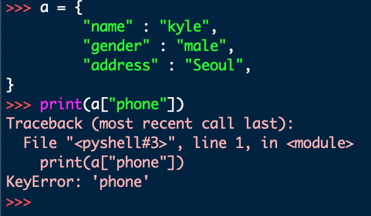

## 06. 딕셔너리 (Dictionary)

### 목차
```ad-note
- [[#06. 딕셔너리 (Dictionary)#1. 해시 테이블|1. 해시 테이블]]
	- [[#1. 해시 테이블#{ Key : Value } 가 저장되는 원리가 무엇일까?|{ Key : Value } 가 저장되는 원리가 무엇일까?]]
- [[#06. 딕셔너리 (Dictionary)#2. 딕셔너리 기본 문법|2. 딕셔너리 기본 문법]]
	- [[#2. 딕셔너리 기본 문법#2-1. 딕셔너리 선언|2-1. 딕셔너리 선언]]
	- [[#2. 딕셔너리 기본 문법#2-2. 딕셔너리 삽입/수정|2-2. 딕셔너리 삽입/수정]]
	- [[#2. 딕셔너리 기본 문법#2-3. 딕셔너리 삭제|2-3. 딕셔너리 삭제]]
	- [[#2. 딕셔너리 기본 문법#2-4. 딕셔너리 삭제 2 - 기본값 설정|2-4. 딕셔너리 삭제 2 - 기본값 설정]]
	- [[#2. 딕셔너리 기본 문법#2-5. 딕셔너리 조회|2-5. 딕셔너리 조회]]
		- [[#2-5. 딕셔너리 조회#조회 시 ==에러발생==|조회 시 ==에러발생==]]
	- [[#2. 딕셔너리 기본 문법#2-6. 조회 시 기본값 설정|2-6. 조회 시 기본값 설정]]
	- [[#2. 딕셔너리 기본 문법#2-7. 딕셔너리 기본 문법 정리|2-7. 딕셔너리 기본 문법 정리]]
- [[#06. 딕셔너리 (Dictionary)#3. 딕셔너리 메서드|3. 딕셔너리 메서드]]
	- [[#3. 딕셔너리 메서드#3-1) .keys()|3-1) .keys()]]
	- [[#3. 딕셔너리 메서드#3-2) .values()|3-2) .values()]]
	- [[#3. 딕셔너리 메서드#3-3) .items()|3-3) .items()]]
```


### 1. 해시 테이블
- 파이썬에는 딕셔너리(dict) 자료구조가 내장 되어 있다. 
- ***Non-sequence & Key-Value***
	- 순서가 있으면 무조건 iterable하다, <br>그러나 순서가 없어도 iterable 할 수 있다. 
- 해시값 → 16진수 '숫자'

```python

{
	 "name" : "kyle",
	 "gender" : "male",
	 "address" : "Seoul",
}
```

- 👉 Key는 immutable (변경 불가능), value 값은 mutable

- 참고
	- 해시 테이블 관련 사이트 👉 [SHA256 online hash function](https://emn178.github.io/online-tools/sha256.html)
	- [Hexadecimal to Decimal converter](https://www.rapidtables.com/convert/number/hex-to-decimal.html)

.png)


#### { Key : Value } 가 저장되는 원리가 무엇일까?
- 일단 리스트를 이용해 **Key: Value**를 저장해보자.





- 딕셔너리는 **해시 테이블(Hash Table)** 을 이용하여 Key: value 를 저장




- **해시 함수**: 임의 길이의 데이터를 고정 길이의 데이터로 매핑하는 함수 
- **해시** : 해시 함수를 통해 얻어진 값

### 파이썬의 딕셔너리 (Dictionary의 특징)
- 해시 함수와 해시 테이블을 이용하기 때문에 삽입, 삭제, 수정, 조회 ***연산의 속도가 리스트보다 빠르다.***
	- (Hash function을 이용한 산술 계산으로 값이 있는 위치를 바로 알 수 있기 때문에)

#### 딕셔너리와 리스트 연산의 시간  복잡도 비교

| 연산 종류   | 딕셔너리 | 리스트             |
| :----------: | :------: | :----------------: |
| Get Item    | $O(1)$   | $O(1)$             |
| Insert Item | $O(1)$   | $O(1)$ 또는 $O(N)$ |
| Update Item | $O(1)$   | $O(1)$             |
| Delete Item | $O(1)$   | $O(1)$ 또는 $O(N)$ |
| Search Item | $O(1)$   | $O(N)$             |

- 가령, `insert`의 경우 리스트 어디에 넣을지 확인해야 한다. 
	- 마지막에 넣을지(append) or 특정 지점에 넣을 지

#### 딕셔너리는 언제 사용해야 할 까?
1. 리스트를 사용하기 힘든 경우
2. 데이터에 대한 빠른 접근 탐색이 필요한 경우
3. (현실 세계의 대부분의 데이터를 다룰 경우)

### 2. 딕셔너리 기본 문법

#### 2-1. 딕셔너리 선언
- 변수 = { key1: value1, key2: value2 ...}

```python
a = {
	 "name" : "kyle",
	 "gender" : "male",
	 "address" : "Seoul",
}

print(a)
>>> {"name": "kyle","gender": "male","address": "Seoul"
}
``` 
- 👉 이때, 줄 바꾸는 것을 line break 라고 한다. 

#### 2-2. 딕셔너리 삽입/수정
- `딕셔너리[key] = value`
- 내부에 해당 key가 없으면 삽입, 있으면 수정

```python
# 삽입
a = {
	 "name" : "kyle",
	 "gender" : "male",
	 "address" : "Seoul",
}

a["job"] = "coach"

print(a)
>>> {"name": "kyle","gender": "male","address": "Seoul", "job": "coach"}

#################################################

# 수정
a = {
	 "name" : "kyle",
	 "gender" : "male",
	 "address" : "Seoul",
}

a["name"] = "Justin"

print(a)
>>> {"name": "Justin","gender": "male","address": "Seoul"}
``` 

```ad-tip
- 많은 프로그래밍 언어에서 대괄호 `[]` 는 **조회 기능**으로 쓰인다.
	- list[1]
	- dict[key]
```

```python
list_like_dict = {
	  0: 1,
	  1: 2,
	  2: 3
}

list_like_dict[0]

```

```python
# Counting
scores = ["A", "A", "B", "C", "D", "A", "B"]

counter = {
	"A" : 0, 
	"B" : 0,
	"C" : 0,
	"D" : 0
}

for score in scores:
	counter[score] += 1

print(counter)
# {'A': 3, 'B': 2, 'C': 1, 'D': 1}
##########################

from collections import Counter

scores = ["A", "A", "B", "C", "D", "A", "B"]

easy_counter = Counter(scores)
print(easy_counter)
# Counter({'A': 3, 'B': 2, 'C': 1, 'D': 1})
```

#### 2-3. 딕셔너리 삭제
- 딕셔너리.pop(key)
	- '삭제 및 반환' → ***return  값 있음!***
	- 내부에 존재하는 key에 대한 value 삭제 및 반환, 존재하지 않는 key에 대해서는 keyError 발생
```python
a = {
	 "name" : "kyle",
	 "gender" : "male",
	 "address" : "Seoul",
}

gender = a.pop("gender")

print(a)
print(gender)
>>> {"name": "kyle","address": "Seoul"}
>>> male
```

```python
a = {
	 "name" : "kyle",
	 "gender" : "male",
	 "address" : "Seoul",
}

phone = a.pop("phone")

print(a)
print(phone)

```

- 에러발생
	- 👉 존재하지 않는 키에 접근했기 때문


#### 2-4. 딕셔너리 삭제 2 - 기본값 설정
- 딕셔너리.pop(key, default)
- 두 번째 인자로 default값(기본값)을 지정하여 KeyError 방지 가능

```python
a = {
	 "name" : "kyle",
	 "gender" : "male",
	 "address" : "Seoul",
}

phone = a.pop("phone", "010-1234-5678")

print(a)
print(phone)
>>> {"name": "kyle","gender": "male","address": "Seoul"}
>>> 010-1234-5678
```

#### 2-5. 딕셔너리 조회
- key에 해당하는 value 반환
- `딕셔너리[Key]` 또는 `딕셔너리.get(key)`
```python
# 딕셔너리[Key]

a = {
	 "name" : "kyle",
	 "gender" : "male",
	 "address" : "Seoul",
}

print(a["name"])
>>> Kyle

#################################

# 딕셔너리.get(key)

a = {
	 "name" : "kyle",
	 "gender" : "male",
	 "address" : "Seoul",
}

print(a.get("name"))
>>> Kyle
```


##### 조회 시 ==에러발생==
- 👉 딕셔너리에 존재하지 않는 키를 사용하면 에러가 발생한다. 
```python
a = {
	 "name" : "kyle",
	 "gender" : "male",
	 "address" : "Seoul",
}

print(a["phone"])
```

- 

#### 2-6. 조회 시 기본값 설정
- `딕셔너리.get(key,default)`
```python
a = {
	 "name" : "kyle",
	 "gender" : "male",
	 "address" : "Seoul",
}

print(a.get("phone"))
>>> none

##################################

a = {
	 "name" : "kyle",
	 "gender" : "male",
	 "address" : "Seoul",
}

print(a.get("phone", "없음"))
>>> 없음
```

```ad-tip
- `딕셔너리[key]`의 경우 해당 키 없으면 → 에러발생!
- `딕셔너리.get('key')`의 경우  → none 반환!
	- `딕셔너리.get('key', 0)` 처럼 default 값을 지정할 수 있다.
- `딕셔너리[key]`와 `딕셔너리.get('key')` 둘다 시간 복잡도 $O(1)$ (=상수 시간 복잡도)
```

#####  딕셔너리를 이용한 빠른 인덱스
- [ ] BOJ_10546 배부른 마라토너 #todo
- [ ] BOJ_10816 숫자카드2 #todo 

- 예시코드
	```python
	for i in range(num):
		temp = input()
		if mara_dict.get(temp, 0) != 0:
			mara_dict[temp] += 1
		else:
			mara_dict[temp] = 1
	```


#### 2-7. 딕셔너리 기본 문법 정리
| 선언 | 변수 = { Key: value1, key2: value2... } |
| --- | --- |
| 삽입 | 딕셔너리[key] = value |
| 삭제 | 딕셔너리.pop(key, default) |
| 조회 | 딕셔너리[key] 또는 딕셔너리.get(key, default) |

- 👉 ==non-sequence but iterable==

```python
john = {
	"name" : "john"
	"role" : "ceo"
}

# 키값을 순회
for elem in john:
	print(john)
>>>
name role

# values 값을 순회
for elem in john:
	print(john[elem])
>>>
john ceo

john.keys()
# 튜플이 나옴 
type(john.keys())

for key in john.keys():
	print(key)

```

### 3. 딕셔너리 메서드
```
1) .keys()
2) .values()
3) .items()
```

#### 3-1) .keys()
- 딕셔너리의 **Key 목록**이 담긴 dict_keys 객체 반환

```python
a = {
	 "name" : "kyle",
	 "gender" : "male",
	 "address" : "Seoul",
}

print(a.keys())
>>> dict_keys(['name', 'gender', 'address'])

##################################

a = {
	 "name" : "kyle",
	 "gender" : "male",
	 "address" : "Seoul",
}

for key in a.keys():
	print(key)
>>> name
gender
address

##################################

a = {
	 "name" : "kyle",
	 "gender" : "male",
	 "address" : "Seoul",
}

for key in a:
	print(key)
>>> name
gender
address
```

#### 3-2) .values()
- 딕셔너리의 **value 목록**이 담긴 dict_values 객체 반환
```python
a = {
	 "name" : "kyle",
	 "gender" : "male",
	 "address" : "Seoul",
}

print(a.values())
>>> dict_values(['kyle', 'male', 'Seoul'])

##############################################

a = {
	 "name" : "kyle",
	 "gender" : "male",
	 "address" : "Seoul",
}

for value in a.values():
	print(value)

>>>Kyle
male
Seoul
```


#### 3-3) .items()
- 딕셔너리의 **(key, value) 쌍 목록**이 담긴 dict_items 객체 반환

```python
a = {
	 "name" : "kyle",
	 "gender" : "male",
	 "address" : "Seoul",
}

print(a.items()) : #튜플들이 요소로된 리스트가 출력됨
>>> dict_items([('name', 'kyle'),('gender', 'male'),('address','Seoul')])

#################################################

a = {
	 "name" : "kyle",
	 "gender" : "male",
	 "address" : "Seoul",
}

for item in a.items()
	print(item)
>>>('name', 'kyle')
('gender', 'male')
('address','Seoul')


#################################################

a = {
	 "name" : "kyle",
	 "gender" : "male",
	 "address" : "Seoul",
}

for key, value in a.items(): # 또는 약어로 k,v 많이 사용
	print(key, value)
>>> name Kyle
gender male
address Seoul
```


- 딕셔너리 활용 연습 (JUNGOL)
	- [x] [# 945 : 기타 자료형 - 자가진단 5](http://jungol.co.kr/bbs/board.php?bo_table=pbank&wr_id=4372&sca=pyd0)
	- [x] [# 946 : 기타 자료형 - 자가진단 6](http://jungol.co.kr/bbs/board.php?bo_table=pbank&wr_id=4373&sca=pyd0)
	- [x] [# 953 : 기타 자료형 - 형성평가 6](http://jungol.co.kr/bbs/board.php?bo_table=pbank&wr_id=4380&sca=pyd0) 

```python
# Q.945

comic_dict = {
	'Pokemon':'Pikachu', 
	'Digimon':'Agumon', 
	'Yuhioh':"Black Magician"}

while True:
	temp = input()
	if temp == 'quit':
		break
	print(comic_dict.get(temp, "I don't know"))

################################################
# Q. 946

N = int(input())

nations_dict = {}
for i in range(N):
	k, v = input().split()
	nations_dict[k] = v

country = input()
print(nations_dict.get(country, "Unknown country"))

################################################
# Q. 953

# Jay John John Jay Jack Jack John Jo Jo Jack


# 선수 이름 줄줄이 입력 받음 
baseb_sco = list(map(str, input().split()))


# 딕셔너리에 파울 횟수 기록
baseb_dict = {}
for i in range(len(baseb_sco)):
	
	if baseb_dict.get(baseb_sco[i], 0) != 0: # 2회차 이상 기록하는 경우
		baseb_dict[baseb_sco[i]] += 1
	else:
		baseb_dict[baseb_sco[i]] = 1 # 처음 기록하는 경우


temp = list(baseb_dict.items()) # 딕셔너리를 리스트화해서
temp.sort(key = lambda x: (x[1])) # 파울 횟수 기준으로 정렬

for i in range(len(temp)):
	print(temp[i][0]) # 선수 이름을 출력하고

	if temp[i][1] != temp[i+1][1]: # 동일한 기록이 있는지 체크
		break
print(temp[0][1]) # 파울 횟수 출력

```

- Q. 953 → [[../../Algo Solving/다양한 방법으로 정렬하기 (BOJ_1931)]] 참조함

```python
data = {}

number = int(input())

for _ in range(number):
	user_input = input().split()
	# name capital

	data[user_input[0]] = user_input[1]
	# data["korea"] = "Seoul"

user_answer = input()
# korea

print(data[user_answer])
# data["korea"] ⇒ "Seoul"
```