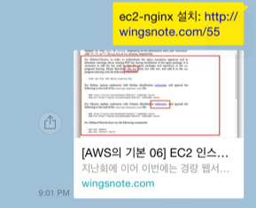

### Intro

#### 웹 사이트의 구성 요소

- 예시 살펴보기 : https://html-css-js-com/
	- 
	- 

#### 웹 사이트와 브라우저 
- 웹 사이트는 브라우저를 통해 동작함 
- 브라우저마다 동작이 약간씩 달라서 문제가 생기는 경우가 많음(파편화)
- 해결책으로 웹 표준이 등장 
^[https://itblogsjm.tistory.com/7] 

#### 웹 표준
- 웹에서 표준적으로 사용되는 기술이나 규칙
- 어떤 브라우저든 웹 페이지가 동일하게 보이도록 함(크로스 브라우징)

- [Can I use?](https://caniuse.com/)
	- 브라우저별 호환성 체크
	- 

### 개발 환경 설정 

#### Visual Studio Code
- HTML/CSS 코드 작성을 위한 Visual Studio Code 추천 확장 프로그램
	- Open in browser
	- Auto Rename Tag
	- Auto Close Tag
	- Intellisense for CSS class names in HTML
	- HTML CSS Support

#### 크롬 개발자 도구
- 웹 브라우저 크롬에서 제공하는 개발과 관련된 다양한 기능을 제공
- 주요 기능
	- Elements – DOM 탐색 및 CSS 확인 및 변경
		- Styles – 요소에 적용된 CSS 확인
		- Computed – 스타일이 계산된 최종 결과
		- Event Listeners – 해당 요소에 적용된 이벤트 (JS)
	- Sources, Network, Performance, Application, Security, Audits 등

### HTML 기초
#### HTML
- Hyper Text Markup Language 
- 웹 페이지를 작성(구조화)하기 윈한 언어
- `.html` ⇒ HTML 파일 확장
	- Naver 사이트에 접속해서 개발자 도구를 활용해 CSS를 삭제한다면?
		- HTML만 남은 웹 사이트를 확인할 수 있음

- Hyper Text 란? - [위키백과](https://ko.wikipedia.org/wiki/%ED%95%98%EC%9D%B4%ED%8D%BC%ED%85%8D%EC%8A%A4%ED%8A%B8)
	- 👉 참조(하이퍼링크)를 통해 사용자가 한 문서에서 다른 문서로 즉시 접근할 수 있는 텍스트
	- 

- **Markup Language** - [위키백과](https://ko.wikipedia.org/wiki/%EB%A7%88%ED%81%AC%EC%97%85_%EC%96%B8%EC%96%B4)
	- 태그 등을 이용하여 문서나 데이터의 구조를 명시하는 언어 • 대표적인 예 – HTML, Markdown
	- 
	- 예시
		- 

- HTML 스타일 가이드
	- 

### HTML 기본 구조
- **html** : 문서의 최상위(root) 요소
- **head** : 문서 메타데이터 요소
	- 문서 제목, 인코딩, 스타일, 외부 파일 로딩 등
	- 일반적으로 브라우저에 나타나지 않는 내용
- **body** : 문서 본문 요소
	- 실제 화면 구성과 관련된 내용

- **head 예시**
	- `<title>` : 브라우저 상단 타이틀
	- `<meta>` : 문서 레벨 메타데이터 요소
	- `<link>` : 외부 리소스 연결 요소 (CSS 파일, favicon 등)
	- `<script>` : 스크립트 요소 (JavaScript 파일/코드)
	- `<style>` : CSS 직접 작성

- head 예시 : **Open Graph Protocol**
	- 메타 데이터를 표현하는 새로운 규약
		- HTML 문서의 메타 데이터를 통해 문서의 정보를 전달
		- 메타정보에 해당하는 제목, 설명 등을 쓸 수 있도록 정의
		- 👇 아래 예시 처럼, 링크를 보냈을 때, 해당 페이지의 정보나 그림등을 볼 수 있는 기술을 말한다.

^[https://eminentstar.tistory.com/38]

##### 요소(elemenet)

- HTML 요소는 시작 태그와 종료 태그 그리고 태그 사이에 위치한 내용으로 구성
	- 요소는 태그로 컨텐츠(내용)를 감싸는 것으로 그 정보의 성격과 의미를 정의
	- 내용이 없는 태그들도 존재(닫는 태그가 없음)
		- `br, hr, img, input, link, meta`
- 요소는 중첩(nested)될 수 있음
	- 요소의 중첩을 통해 하나의 문서를 구조화
	- 여는 태그와 닫는 태그의 쌍을 잘 확인해야함
	- 오류를 반환하는 것이 아닌 그냥 레이아웃이 깨진 상태로 출력되기 때문에, 디버깅이 힘들어 질 수 있음

- HTML with 개발자 도구
	- **elements** : 해당 요소의 HTML 태그
	- 
	- 속성(attribute)
	- 
	- 속성(atrribute) 작성 방식 통일하기 
	- 
- 속성(attribute)
- 속성을 통해 태그의 부가적인 정보를 설정할 수 있음
- 요소는 속성을 가질 수 있으며, 경로나 크기와 같은 추가적인 정보를 제공
- 요소의 시작 태그에 작성하며 보통 이름과 값이 하나의 쌍으로 존재
- 태그와 상관없이 사용 가능한 속성(HTML Global Attribute)들도 있음

HTML Global Attribute
- 모든 HTML 요소가 공통으로 사용할 수 있는 대표적인 속성 (몇몇 요소에는 아무 효과가 없을 수 있음)
	- **id** : 문서 전체에서 유일한 고유 식별자 지정
	- **class** : 공백으로 구분된 해당 요소의 클래스의 목록 (CSS, JS에서 요소를 선택하거나 접근)
	- **data-\***: 페이지에 개인 사용자 정의 데이터를 저장하기 위해 사용
	- **style** : inline 스타일
	- **title** : 요소에 대한 추가 정보 지정
	- **tabindex** : 요소의 탭 순서
- HTML Global Attribute 예시
	

- 텍스트로 작성된 코드가 어떻게 웹 사이트가 되는 걸까? 
- **렌더링(Rendering)**
	- 👉 웹사이트 코드를 사용자가 보게 되는 웹 사이트로 바꾸는 과정

**DOM(Document Object Model) 트리**
- 텍스트 파일인 HTML 문서를 브라우저에서 렌더링 하기 위한 구조
	- HTML 문서에 대한 모델을 구성함
	- HTML 문서 내의 각 요소에 접근 / 수정에 필요한 프로퍼티와 메서드를 제공함

인라인 / 블록 요소
- HTML 요소는 크게 인라인 / 블록 요소로 나눔
- 인라인 요소는 글자처럼 취급
- 블록 요소는 한 줄 모두 사용

- 텍스트 요소

| 태그                             | 설명                                                                   |
| :------------------------------: | ---------------------------------------------------------------------- |
| ``                        | href 속성을 활용하여 다른 URL로 연결하는 하이퍼링크 생성               |
| `<b></b>` `<strong></strong>` | 굵은 글씨 요소  중요한 강조하고자 하는 요소 (보통 긁은 글씨로 표현) |
| `<i></i>` `<em></em>`         | 기울임 글씨 요소 중요한 강조하고자 하는 요소 (보통 기울임 글씨로 표현) |
| ` `                           | 텍스트 내에 줄 바꿈 생성                                               |
| ``                          | src 속성을 활용하여 이미지 표현,  alt 속성을 활용하여 대체 텍스트   |
| ``                  | 의미 없는 인라인 컨테이너                                              |

- 그룹 컨텐츠

| 태그                        | 설명                                                                                  |
| :---------------------------: | ------------------------------------------------------------------------------------- |
| `

`                   | 하나의 문단 (paragraph)                                                               |
| `
`                      | 문단 레벨 요소에서의 주제의 분리를 의미하며  수평선으로 표현됨 (A Horizontal Rule) |
| `<ol></ol>`  `<ul></ul>` | 순서가 있는 리스트 (ordered)  순서가 없는 리스트 (unordered)                       |
| `<pre></pre>`               | HTML에 작성한 내용을 그대로 표현.  보통 고정폭 글꼴이 사용되고 공백문자를 유지     |
| `<blockquote></blockquote>` | 텍스트가 긴 인용문  주로 들여쓰기를 한 것으로 표현됨                               |
| `

`               | 의미 없는 블록 레벨 컨테이너                                                          |

