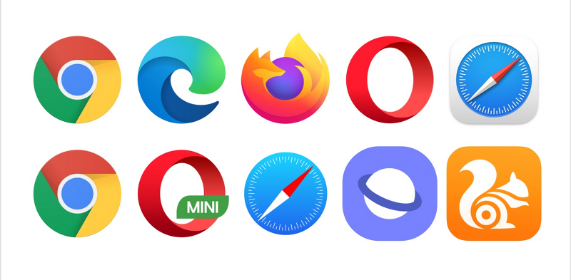
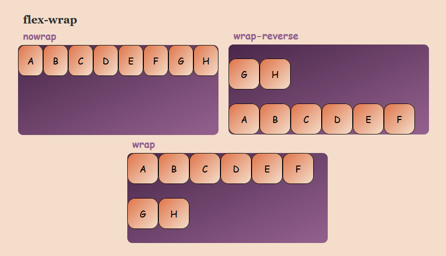

#### intro 


- (실습문제) 전체틀이 900px이고, 카드 너비가 300px인데, 3개 넣으면 다음 줄로 넘어가는 이유<br>→ nline-block 속성일 때 공백값이 4px 있음 (디폴트 값)<br>→ `margin: -4px;` 해줘야 함

- 마진 상쇄 (여백 상쇄 정복)
	- [Reboot CSS](https://gist.github.com/marharyta/b83a3683085eb42867bbcefb34687af8)


### CSS Position
- 문서 상에서 요소의 위치를 지정
- static : 모든 태그의 기본 값(기준 위치)
	- 일반적인 요소의 배치 순서에 따름(좌측 상단) ==→ nomal flow==
	- 부모 요소 내에서 배치될 때는 부모 요소의 위치를 기준으로 배치 됨
- 아래는 좌표 프로퍼티(top, bottom, left, right)를 사용하여 이동 가능 
	1. relative 
	2. absolute 
	3. fixed 
	4. sticky

%%
- 앱솔루트- 결혼
- 렐러티브- 입대
- ???
%%


1. **relative : 상대 위치**
	- 자기 자신의 static 위치를 기준으로 이동 (normal flow 유지)
	- 레이아웃에서 요소가 차지하는 공간은 static일 때와 같음 (normal position 대비 offset) 
2. **absolute : 절대 위치**
	- 요소를 일반적인 문서 흐름에서 제거 후 레이아웃에 공간을 차지하지 않음 (normal flow에서 벗어남)
	- static이 아닌 가장 가까이 있는 부모/조상 요소를 기준으로 이동 (없는 경우 브라우저 화면 기준으로 이동) 
3. **fixed : 고정 위치**
	- 요소를 일반적인 문서 흐름에서 제거 후 레이아웃에 공간을 차지하지 않음 (normal flow에서 벗어남)
	- 부모 요소와 관계없이 viewport를 기준으로 이동
		- 스크롤 시에도 항상 같은 곳에 위치함
4. **sticky: 스크롤에 따라 static -> fixed로 변경**
	- 속성을 적용한 박스는 평소에 문서 안에서 position: static 상태와 같이 일반적인 흐름에 따르지만 <u>스크롤 위치가 임계점에 이르면 position: fixed와 같이 박스를 화면에 고정</u>할 수 있는 속성


1. static


2. relative


3. absolute


4. fixed


#### absolute vs relative

- 형에게 `top: 100px;`을 적용했을 때 absolute와 relative의 차이를 알아보자 
	- absolute → normal flow 벗어남
	- relative → 유지


```html
<!DOCTYPE html>
<html lang="en">

<head>
  <title>Document</title>
  <link rel="stylesheet" href="mystyle.css">
  <style>
    /* 공통 스타일링 */
    div {
      box-sizing: border-box;
      width: 100px;
      height: 100px;
      border: 1px solid black;
    }
    .parent {
      position: relative;
      width: 300px;
      height: 300px;
    }
    /* 차이점 확인해보기 */
    .absolute {
      position: absolute;
      top: 100px;
      left: 100px;
      background-color: crimson;
    }
    .sibling {
      background-color: deepskyblue;
    }
    .relative {
      position: relative;
      top: 100px;
      left: 100px;
      background-color: crimson;
    }
</style>
  </head>

<body>
  <div class="parent">
      <div class="absolute">형</div>
      <div class="sibling">동생</div>
    </div>
    <div class="parent">
      <div class="relative">형</div>
      <div class="sibling">동생</div>
    </div>    
</body>

</html>
```

##### absolut는 언제 쓸까요?


##### fixed는 언제 쓸까요?


#### position sticky
- sticky: 스크롤에 따라 static → fixed로 변경
	- 속성을 적용한 박스는 평소에 문서 안에서 position: static 상태와 같이 일반적인 흐름에 따르지만, 스크롤 위 치가 임계점에 이르면 position: fixed와 같이 박스를 화면에 고정할 수 있는 속성
	- 일반적으로 Navigation Bar에서 사용됨.

#### CSS 원칙
- **CSS 원칙 I, II : Normal flow**
	- 모든 요소는 네모(박스모델), 좌측상단에 배치
	- display에 따라 크기와 배치가 달라짐
- **CSS 원칙 III**
	- ==position으로 위치의 기준을 변경==
		- relative : 본인의 원래 위치
		- absolute : 특정 부모의 위치
		- fixed : 화면의 위치
		- sticky: 기본적으로 static이나 스크롤 이동에 따라 fixed로 변경

### CSS Layout
- CSS layout techniques
	- Display
	- Position
	- Float (CSS1, 1996)
	- Flexbox (2012)
	- Grid (2017)
	- 기타
		- Responsive Web Design(2010), Media Queries (2012)

### Float
#### CSS 원칙 I

- Normal Flow
- 모든 요소는 **네모(박스모델)** 이고, 위에서부터 아래로, 왼쪽에서 오른쪽으로 쌓인다. **(좌측 상단에 배치)**

```ad-question
- 어떤 요소를 감싸는 형태로의 배치는?
- 혹은 좌/우측에 배치는?
```

#### Float
- 박스를 왼쪽 혹은 오른쪽으로 이동시켜 텍스트를 포함 인라인요소들이 주변을 wrapping 하도록 함
- 요소가 Normal flow를 벗어나도록 함
^[https://jwss.tistory.com/13]


```html
<!DOCTYPE html>
<html lang="en">

<head>
  <title>Document</title>
  <link rel="stylesheet" href="mystyle.css">
  <style>
    .box {
      width: 150px;
      height: 150px;
      border: 1px solid black;
      background-color: crimson;
      color: white;
      margin-right: 30px;
    }
    .left {
      float: left;  
    }

</style>
  </head>

  <body>
    <div class="box left">float left</div>
    <p>lorem300 자동완성으로 길게</p>
  </body>

</html>
```


### Flexbox
#### CSS Flexible Box Layout
- 행과 열 형태로 아이템들을 배치하는 1차원 레이아웃 모델
- 축
	- main axis (메인 축)
	- cross axis (교차 축)
- 구성 요소
	- Flex Container (부모 요소)
	- Flex Item (자식 요소)

^[https://velog.io/@alicesykim95/CSS-Flex-Box]

- Flexbox 축
	- flex-direction : row


#### Flexbox 구성 요소
```css
.flex-container{
	display: flex;	
}
```

- **Flex Container (부모 요소)**
	- flexbox 레이아웃을 형성하는 가장 기본적인 모델
	- Flex Item들이 놓여있는 영역
	- display 속성을 flex 혹은 inline-flex로 지정
- **Flex Item (자식 요소)**
	- 컨테이너에 속해 있는 컨텐츠(박스)


```ad-question
- 왜 Flexbox를 사용해야 할까?
- 이전까지 Normal Flow를 벗어나는 수단은 Float 혹은 Position
- **하기 어려웠던 것?**
	(수동 값 부여 없이)
	1. 수직 정렬
	2. 아이템의 너비와 높이 혹은 간격을 동일하게 배치
```

#### flexbox 시작
```css
 .flex-container {
	 display: flex;
 }
```

- 👉 부모 요소에 `display: flex` 혹은 `inline-flex`

#### Felx 속성
- 배치 설정
	- flex-direction
	- flex-wrap
- 공간 나누기
	- justify-content (main axis)
	- align-content (cross axis)
- 정렬
	- align-items (모든 아이템을 cross axis 기준으로)
	- align-self (개별 아이템)

- 참고 문서:  https://byteiota.com/flexbox-conatiner/

##### Flex 속성 : flex-direction
- Main axis 기준 방향 설정
- 역방향의 경우 HTML 태그 선언 순서와 시각적으로 다르니 유의 (웹 접근성에 영향)


##### Flex 속성 : flex-wrap
- 아이템이 컨테이너를 벗어나는 경우 해당 영역 내에 배치되도록 설정
- 즉, 기본적으로 컨테이너 영역을 벗어나지 않도록 함
- 

###### Flex 속성 : flex-direction & flex-wrap
- flex-direction : Main axis의 방향을 설정
- flex-wrap : 요소들이 강제로 한 줄에 배치 되게 할 것인지 여부 설정
	- nowrap (기본 값) : 한 줄에 배치
	- wrap : 넘치면 그 다음 줄로 배치
- flex-flow
	- flex-direction 과 flex-wrap 의 shorthand
	- flex-direction과 flex-wrap에 대한 설정 값을 차례로 작성
	- 예시) flex-flow: row nowrap;


##### Flex 속성 : justify-content
- Main axis를 기준으로 공간 배분


##### Flex 속성 : align-content
- Cross axis를 기준으로 공간 배분 (아이템이 한 줄로 배치되는 경우 확인할 수 없음)

- 추가로 `space-evenly` 가 있음

###### Flex 속성 : justify-content & align-content
- 공간 배분
	- flex-start (기본 값) : 아이템들을 axis 시작점으로
	- flex-end : 아이템들을 axis 끝 쪽으로
	- center : 아이템들을 axis 중앙으로
	- space-between : 아이템 사이의 간격을 균일하게 분배
	- space-around : 아이템을 둘러싼 영역을 균일하게 분배 (가질 수 있는 영역을 반으로 나눠서 양쪽에)
	- space-evenly : 전체 영역에서 아이템 간 간격을 균일하게 분배

##### Flex 속성 : align-items
- 모든 아이템을 Cross axis를 기준으로 정렬


```ad-tip
- 베이스 라인(baseline)→ 폰트 관련
	- 글씨의 기준선(밑줄)을 기준으로 정렬


```

##### Flex 속성 : align-self
- 개별 아이템을 Cross axis 기준으로 정렬
- ==주의! 해당 속성은 컨테이너에 적용하는 것이 아니라 개별 아이템에 적용==

^[https://www.samanthaming.com/flexbox30/28-align-self/]


###### Flex 속성 : align-items & align-self
- Cross axis를 중심으로
	- stretch (기본 값) : 컨테이너를 가득 채움
	- flex-start : 위
	- flex-end : 아래
	- center : 가운데
	- baseline : 텍스트 baseline에 기준선을 맞춤


###### Flex에 적용하는 속성
- 기타 속성
	- flex-grow : 남은 영역을 아이템에 분배
	- order : 배치 순서


###### 활용 레이아웃 – 수직 수평 가운데 정렬


```css
/* 방법 1
컨테이너 설정
*/
.container {
  display: flex;
  justify-content: center;
  align-items: center;
}

/* 방법 2
아이템 설정
*/
.container {
  display: flex;
}
.item {
  margin: auto;
}

```


###### 활용 레이아웃 – 카드배치

- 카드배치는 Grid 디스플레이로도 표현 가능…!
	- justify 조정하다
	- align 맞추다 / 일직선으로 하다

```css
#layout_03 {
	display: flex;
	flex-direction: column;
	flex-wrap: wrap;
	justify-content: space-around;
	align-content: space-around;
}

#layout_03 {
    display: flex;
    flex-direction: row;
    flex-wrap: wrap;
    justify-content: space-around;
    align-content: space-around;
}
```


- 학습 사이트 추천
	- [web.dev](http://web.dev) → learn CSS!

```ad-tip
- emmet
	- `link:css` 입력하고 enter


- flex-grow: 비율 / 가중치를 준다
```

### 배운 내용 정리
```
- HTML→ 구조를 잡는 것

- CSS→ 선택해서 스타일링

- 마크업이 안 되어 있다? → 스타일링 불가능

- 스타일링은 클래스로!

- 박스 모델 (마진, 패딩, 보더)

- nomal flow → 최상단 최좌측

- position

	(기준) 좌표 기준

	- relative
	- absolute

	브라우저 기준

	- fixed
	- sticky

- Flex (main axis - cross axis)
```

- 웹 과정에서 추가 공부는 특정 사이트를 따라 해보기 (클론 코딩)

- css 속성 순서
	- 구글 css 스타일 가이드 -> 알파벳순!
	- NHN 코딩 컨벤션 → 중요도에 따라

- css 스타일 + 상속
	- SASS, SCSS → CSS 변형