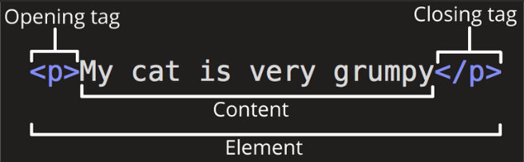
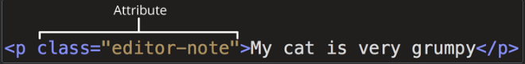

### 목차
```ad-note
- [[#개요|개요]]
- [[#elements (요소)|elements (요소)]]
- [[#속성(attribute)|속성(attribute)]]
- [[#이미지|이미지]]
- [[#제목|제목]]
- [[#문단|문단]]
- [[#연결|연결]]
```


### 개요
- HyperText Markup Language.
- 웹을 이루는 가장 기초적인 구성 요소로, 웹 콘텐츠의 의미와 구조를  정의할 때 사용.
- 이때, **"Hypertext(하이퍼텍스트)"**란 웹 페이지를 다른 페이지로 연결하는 링크를 말함.
- 그 외 웹을 표현하는 요소
	- 웹 페이지의 모양/표현 ([CSS](https://developer.mozilla.org/ko/docs/Web/CSS))
	- 기능/동작 ([JavaScript](https://developer.mozilla.org/ko/docs/Web/JavaScript))

- HTML은 웹 브라우저에 표시되는 글과 이미지 등의 다양한 콘텐츠를 표시하기 위해 "마크업"을 사용.
- HTML 마크업은  다양한 "요소"를 사용하는데, 그 종류는 아래와 같다. 

  ```html
   <head>, <title>, <body>, <header>, <footer>, <article>, <section>, <p>, <div>, <span>, , <aside>, <audio>, <canvas>, <datalist>, <details>, <embed>, <nav>, <output>, <progress>, <video>, <ul>, <ol>, <li> 등등
  ```

- HTML → `<tag>`  사용해서 구분
	- `<` 태그 내용 `/>` : 태그 내용 양 옆에 괄호로 구분
	- 대소문자 혼합, 또는 섞어서도 표현 가능 `<Title>` `<title>` `<TITLE>` 모두 동일

- HTML 은 프로그래밍 언어가 아닙니다; 컨텐츠의 구조를 정의하는 마크업 언어입니다.


### elements (요소)
```html
<p>내 고양이는 고약해</p>
```
- 여는 태그 `<p>`
- 닫는 태그 `</p>`
- 컨텐츠 `내 고양이는 고약해`
- 요소(elements) :  여는 태그 + 닫는 태그 + 컨텐츠를 포함한 모든 요소

- 요소는 중첩이 가능
  ```html
    <p>내 고양이는 <strong>아주</strong> 고약해.</p>
    ```

- 빈 요소
  ```html
    
    ```

  - 닫는 태그 `</img>` 가 존재하지 않음. 속성값(`src='~'`, `alt="~"`)만 2개 존재.


### 속성(attribute)
1. 요소 이름과 속성 사이에 공백이 있어야 한다
2. 속성 이름 뒤에는 등호(=)가 와야 한다. 
3. 속성 값의 앞 뒤에 열고 닫는 인용부호(`"`또는 `'`)가 있어야 한다. 

```html
<!-- HTML 예시 -->

<!DOCTYPE html>
<html>
  <head>
    <meta charset="utf-8">
    <title>My test page</title>
  </head>
  <body>
    
  </body>
</html>
```




### 이미지

```html

```

- `src` (source) : 필수 주소값
- `alt` (alternative) 
	- `src` 주소값에 오류가 있을 때 대체 텍스트로 활용
	- 설명적인 문자(descriptive text)를 사용하여 표현 
		- (Firefox 로고 ▶ 파이어폭스 로고: 지구를 둘러싼 타오르는 여우 )
	- 또는 시각 장애인 등의 일반적인 접근이 어려울 경우 웹 접근성을 확장시켜 주는 역할(스크린 리더 등) 


### 제목
```html
<h1>My main title</h1>
<h2>My top level heading</h2>
<h3>My subheading</h3>
<h4>My sub-subheading</h4>
```


### 문단
```html
<p>At Mozilla, we’re a global community of</p>

<ul>
  <li>technologists</li>
  <li>thinkers</li>
  <li>builders</li>
</ul>

<p>working together ... </p>

```

- `<p> </p>` : paragraph
- `<ul></ul>` : 순서가 없는 목록 (unordered list)
- `<ol></ol>` : 순서가 없는 목록 (ordered list)
- `<dl></dl>`

  
### 연결
```html
<a href="https://www.mozilla.org/en-US/about/manifesto/">Mozilla Manifesto</a>

```

- `<a></a>` anchor
- `href` : hypertext reference
- 프로토콜 잊지 말기! ( `https://` 또는`http://` )

---
- HTML 요소 참고서 (https://developer.mozilla.org/ko/docs/Web/HTML/Element)

