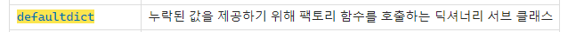
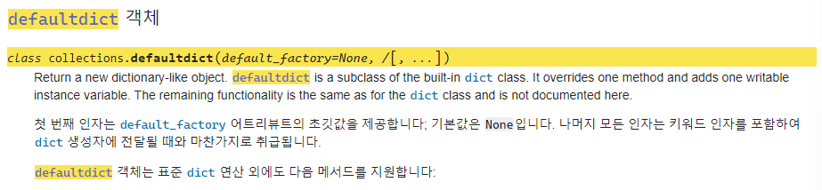
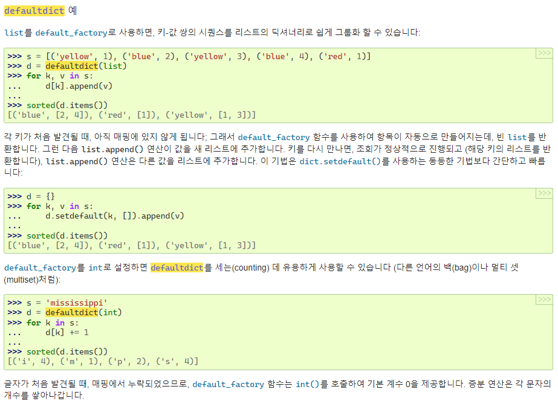

#### 기존 딕셔너리로 카운팅을 하는 방법
```python
catdog = ["cat", "cat", "dog"]

num_catdog = {}
for i in catdog:
	if i not in num_catdog:
		num_catdog[i] = 0
	num_catdog[i] += 1

print(num_catdog)
# {'cat':2, 'dog':1}
```

#### defaultdict의 경우
```python
from collections import defaultdict

catdog = ["cat", "cat", "dog"]

num_catdog = defaultdict(int)
for i in catdog:
	num_catdog[i] += 1

print(num_catdog)

```
- 👉 dictionary 내에 키가 없으면(가령 'cat' 키를 처음 넣을 때), ==기본값을 0으로 설정해서 에러가 발생하지 않는다.==

#### defaultdict의 동작방식
```python
from collections import defaultdict

def func():
	return "FUNCTION"

a = defaultdict(func)
a[1]
# 'FUNCTION'
```
- 👉 괄호 내의 함수를 미리 실행해서 해당 값을 변수에 전달한다.

```python
N = int()
print(N)
# 0
```

#### 활용 예시
- 등장횟수별 동물 리스트를 알고자 할때!
```python
from collections import defaultdict

catdog = ["cat", "cat", "dog"]

item_num = defaultdict(int)
for i in catdog:
    item_num[i] += 1

# print(item_num)
# defaultdict(<class 'int'>, {'cat': 2, 'dog': 1})

num_items = defaultdict(list)
for k, v in item_num.items():
    num_items[v].append(k)

print(num_items)
# defaultdict(<class 'list'>, {2: ['cat'], 1: ['dog']})
```

#### 파이썬 자습서
- [`defaultdict`](https://docs.python.org/ko/3/library/collections.html?highlight=defaultdict#collections.defaultdict "collections.defaultdict") 객체






###### 출처
- [dictionary보다 defaultdict가 깔끔](https://youtu.be/s11btxwhE0s)
- https://docs.python.org/ko/3/library/collections.html?highlight=defaultdict#defaultdict-objects