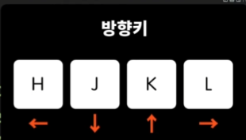

---
tags:
  - youtube
  - 드림코딩
---

- 유튜브 : [Vim 제대로 가르쳐 줌 🤓 (개발자라면 한번쯤 꼭 쓴다는 Vim)](https://youtu.be/cY0JxzENBJg?si=UsLAnG3kh5KesuKZ)

### 기본 명령어 
- 입력모드 `i`
- 명령모드 `esc`

#### 종료옵션 
| 명령어 | 설명      |
| ------ | --------- |
| `:q`   | 그냥 종료 |
| `:q!`  | 강제 종료 |
| `:w`   |  저장         |
| `:w!`  |  강제 저장         |
| `:w`   |  저장하고 종료         |
|`:w`        |  강제 저장하고 종료         |

- `w` : _W_ rite
- `q` : _Q_ uit

#### 입력모드
| 명령어 | 설명              |
| ------ | ----------------- |
| `esc`  | 명령모드로        |
| `i`    | insert (커서 앞)  |
| `a`    | append (커서 뒤)  |
| `I`    | 문장시작으로 이동 |
| `A`       | 문장 끝으로 이동                  |

#### 이동 
- 방향키
- `H`, `J`,`K`, `L`
	- 

### 내비게이션
| 명령어 | 설명             |
| ------ | ---------------- |
| `0`    | 문장 앞으로 이동 |
| `$`    | 문장 뒤로 이동   |
| `W`    | word 단어        |
| `b`    | backward 단어    |
| `3w`   | 3단어씩 이동     |

| 명령어 | 설명             |
| ------ | ---------------- |
| `H`    | 화면 위          |
| `M`    | 화면 중간        |
| `L`    | 화면 끝          |
| `gg`   | 파일 앞          |
| `G`    | 파일 끝          |
| `20G`  | 20번째 줄로 이동 |

| 명령어       | 설명            |
| ------------ | --------------- |
| `ctrl` + `u` | 위로 스크롤링   |
| `ctrl` + `d` | 아래로 스크롤링 |
| `{`          | 문단 시작       |
| `}`          | 문단 끝         |

| 명령어 | 설명                |
| ------ | ------------------- |
| `X`    | 커서 아래 글자 삭제 |
| `dd`   | 문장 삭제           |
| `yy`   | 문장 복사           |
| `p`    | 붙여넣기            |
| `*p`   | 클립보드 붙여넣기   |

- 참고
	- 👉 외부소스(클립보드)에서 붙여넣기 위해선 권한 설정이 필요함


### Vim의 강력한 파워워


#### command + object


- dit → delete inner tags


```
- 3words
- 3backwards
- it : inner(inside)
	- i" : inner "" 
	- ip : inner paragraph
```


| 명령어       | 설명           |
| ------------ | -------------- |
| `.`          | 이전 명령 반복 |
| `u`          | 되감기         |
| `ctrl` + `R` | 앞감기         |
- `u` : undo
- `ctrl` + `R` redo

#### 실전 예시
##### daw - delete a word


##### d3w - delete 3 words


##### d2j
- 아래 두줄 삭제 (`j` → 방향키)
	- 

##### d3k
- 위 3줄  삭제(`k` → 방향키)
	- 

##### dj{
- 중괄호 내의 모든 단어 삭제
	- 

##### di(
- 소괄호 내 모든 단어 삭제
	- 

##### da(
- 소괄호를 포함한 모든 단어 삭제
	- 

##### di' 


##### da'


##### `ci[`
- 대괄호 내 단어 변경시 👉 **자동 입력 모드로 전환**


##### `dj[`
- 대괄호 내 삭제 후  👉 **명령모드 상태 유지**
	- 

##### daw
- delete a word → 단어 하나 삭제(잘라내기) 


##### p

- `P` : 붙여넣기

##### df(
- 소괄호 이전 내용 + _소괄호 까지 삭제 _


##### dt( 
- 소괄호 _이전 내용까지_ 삭제 


##### d/(sh
- 삭제 내용을 보면서 삭제하고 싶을 때


##### d/use
- _use 앞까지_ 삭제


##### /
- 찾기
- 👉명령모드에서 사용가능


###### n
- `n` : next → 다음 찾기


###### ?
- 이전 찾기


#### v
- `v` : 비쥬얼 모드


##### vaw
- visual mode, a word


##### `ctrl` + `v`  
- `ctrl` + `v`  👉 블럭 셀렉트 선택 가능 


### 추가로 Vim에 대해 공부하고 싶다면? 
```vim
vimtutor
```


> **"Don't forget to your dream"**