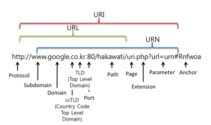

- 비슷한 문서 👉 [Python 용어 정리](../Python/Python%20용어%20정리.md)

#### URI & URL

^[그림 출처: https://programming119.tistory.com/194]

##### URI (Uniform Resource Identifier)
- URI는 특정 리소스를 식별하는 **통합 자원 식별자(Uniform Resource Identifier)** 를 의미한다. 웹 기술에서 사용하는 논리적 또는 물리적 리소스를 식별하는 고유한 문자열 시퀀스다.
	-   **Uniform**은 리소스를 식별하는 통일된 방식을 말한다
	-   **Resource**란, URI로 식별이 가능한 모든 종류의 자원(웹 브라우저 파일 및 그 이외의 리소스 포함)을 지칭한다.
	-   **Identifier**는 다른 항목과 구분하기 위해 필요한 정보이다.

##### URL (Uniform Resource Locator)
- URL은 흔히 웹 **주소**라고도 하며, 컴퓨터 네트워크 상에서 리소스가 **어디 있는지 알려주기(위치)** 위한 규약이다. URI의 하위 개념이다. 

##### URI vs URL
- ==URI= 식별자, URL=식별자+위치 ==
- `elancer.co.kr`은 **URI**입니다. 리소스의 이름만 나타내기 때문이다.
-   반면, `https://elancer.co.kr`은 이름과 더불어, 어떻게 도달할 수 있는지 위치까지 함께 나타내기 때문에 **URL**이다. (프로토콜 ‘https’ 포함)

###### 참조 레퍼런스
- [URI와 URL, 어떤 차이점이 있나요? ](https://www.elancer.co.kr/blog/view?seq=74)

---
### 쿠키 vs 세션 vs 토큰 + 캐시, CDN

**쿠키(Cookie)**
- 쇼핑몰 장바구니 , 검색엔진의 검색기록, 팝업설정(하루동안 열지 않기), 다크모드 설정 등 
- 개인 정보 또는 보안에 민감한 정보 저장에는 부적절

**세션(Session)**
- 로그인 후 서버 메모리 상에 세션 아이디를 저장(유지)
- 유효기간이 종료되면 해당 세션 종료

**토큰(Token)**
- 세션의 메모리 공간의 한계를 해결해줌
-  토큰 유효기간이 끝나기 전까지 통제 불가능, 탈취 당할 위험 → 만료기간을 짧게 설정해서 해결


#### 세션 방식 vs 토큰 방식
|      |                        세션 방식                         |                               토큰 방식                                |
| ---- |:--------------------------------------------------------:|:----------------------------------------------------------------------:|
| 장점 |           사용자의 상태를 원하는대로 통제 가능           |                   상태를 따로 기억해 둘 필요가 없음                    |
| 단점 | 메모리에 로그인 되어 있는 <br>사용자의 상태를 보관해야함 | 한번 로그인한 사용자의 상태는 <br>토큰이 만료될 때까지 제어가 불가능함 |

#### 한줄 정리 
- **쿠키** 는 사용자의 브라우저에 저장되는 정보입니다.
- **세션** 은 서버가 사용자를 기억하고 있는 상태입니다. 
- **토큰** 은 서버가 기억해 둘 필요 없이 사용자가 스스로를 증명할 수 있는 수단입니다.
- **캐시(Cache)** 는 데이터를 다시 가져오지 않도록 가까이 저장해 두는 기술입니다.
- **CDN(Content Delivery Network, 컨텐츠 전송 네트워크)** 은 각지에 캐시 서버를 두어 부하를 분산시키는 기술입니다. 

#### 쿠키 vs 세션
|           |              쿠키               |                 세션                 |
|:---------:|:-------------------------------:|:------------------------------------:|
| 저장 위치 |        사용자의 브라우저        |        서버 (세션 쿠키 제외)         |
| 관리 주체 |             사용자              |            서비스 제공자             |
| 저장 대상 |     가벼운 편의를 위한 정보     | 서버가 관리해야 할 정보 (예: 로그인) |
| 유지 기간 | 브라우저를 종료해도 데이터 유지 |     브라우저 종료 시 데이터 삭제     |
| 요청 속도 |              빠름               |        느림 (서버 처리 필요)         |
|   보안    |     취약 (로컬 기기에 저장)     |    좋음 (브라우저 메모리에 저장)     |

참고문서: <혼자 공부하는 얄팍한 코딩지식 02-3 - 고현민, 한빛미디어>

---
### 모바일 앱의 종류

#### 네이티브 앱
- 안드로이드 → 자바/코틀린 → 구글 플레이 스토어 
- iOS → 스위프트 → 애플 앱스토어
- 스마트폰의 모든 기능 사용 가능, 기기 성능 최대치 활용 가능
- 개발 비용, 개발 속도가 많이 들고, 오래 걸림
- 앱 마켓별 심사 필요

#### 크로스 플랫폼
- 동일한 소스코드로 안드로이드 / iOS 모두에서 동작 가능 (모바일의 경우)
- 구글의 플러터, 페이스북의 리액트 네이티브, MS의 닷넷 마우이(구 자마린)
- 네이티브 앱에 비해 성능에 한계가 있고, 앱 주요 기능 업데이트시 양쪽 앱 마켓의 심사가 필요하다. 
- 주로 한정된 자원을 가진 기기에서 비교적 단순한 기능으로 이뤄진 앱을 제작하는 데 사용

```ad-tip
- 모바일 외에도 운영체제별로 개발 하는 것을 네이티브, 여러 운영체제에서 작동하는 앱을 한번에 개발하는 것을 크로스 플랫폼이라 한다. 
```


#### 웹앱
- 반응형 혹은 적응형 방식을 사용해서 모바일 기기에서 사용하기 적합한 형태로 만든 웹 사이트.
- 웹 개발만으로 모든 기기에 호환되는 모바일 앱을 만들 수 있고, 기능 추가시에도 앱 마켓의 심사가 불필요하다.(웹사이트이기 때문)
- 개발 비용이 상대적으로 저렴하고, 개발 기간도 짧은 편이다. 
- 하지만, 스마트폰에 설치된 브라우저에서 작동하는 웹사이트이기 때문에, '브라우저로 할 수 있는' 기능에 한정되며, 따라서 기기의 활용도와 성능 면에서 많이 뒤처진다.

#### 하이브리드 앱
- 앱의 대다수 콘텐츠를 웹사이트로 제공하면서 추가로 네이티브 앱에서 사용 가능한 기능까지 제공하는 앱을 말한다. 
- 화면 안에 요소를 직접 만들지 않고, 브라우저 역할을 하는 **웹뷰**라는 요소를 만들어 대신 웹 화면을 띄운다.
- 네이티브 앱과 웹 앱의 장단점을 활용해서 제품을 유용하게 운영할 수 있다. 
	- 웹사이트로 구현이 불가능한 필수 기능 → 네이티브 앱 개발
	- 나머지 기능 → 웹 뷰에서 들어갈 웹 사이트 개발

#### PWA
- Progressive Web Apps
- 모바일 웹 사이트의 일종으로, PC나 스마트폰 바탕화면에 아이콘 설치가 가능하고, 푸시 알람을 보낼 수 있는 등 기존 웹 앱의 한계에서 벗어나 보다 나은 접근성과 편의성을 제공한다.
- 브라우저에 따라 푸시 알람 기능, 카메라, 블루투스, 진동 알림 등의 활용이 가능하다.
- 안드로이드폰에서 크롬을 활용할 경우, 다양한 기능이 가능하나, 아이폰은 사파리를 제외한 브라우저에서의 PWA 기능을 차단, 사파리에서도 제한적인 기능만 가능하다. 


#### 한줄 정리
- **네이티브 앱**은 기기에 작동하는 운영체제에 특화된 방식으로 제작된 앱입니다. 
- **크로스 플랫폼**은 하나의 소스 코드로 여러 개의 운영체제에서 작동할 수 있는 프로그램을 만드는 방식입니다. 
- **웹앱**은 모바일 기기의 브라우저에서 접속할 수 있는 모바일 웹사이트로, 모바일 앱과 비슷한 UI/UX를 제공합니다.
- **하이브리드 앱**은 네이티브 앱 안에 웹 뷰로 웹사이트를 실행해서 네이티브 앱과 웹앱의 장점을 취할 수 있는 앱입니다. 
- **PWA**는 아이콘 추가 등 진보된 브라우저 기능을 활용해서 네이티브 앱 같은 다양한 편의 기능을 제공하는 앱입니다. 

참고문서: <혼자 공부하는 얄팍한 코딩지식 02-4 - 고현민, 한빛미디어>

---

### 라이브러리 vs 프레임 워크
- 📌 여러가지 예시를 들어 보자
- 라이브러리가 마트에서 구매할 수 있는 '식재료'라면, 프레임워크는 해당 요리에 필요한 것들을 담아놓은 '밀키트'와 같다. 
- **라이브러리**가 특정 기능을 수행하는 소프트웨어 조각이자 여러 프로그램에 들어갈 수 있는 부품이라면, **프레임워크**는 라이브러리와 자체 코드를 엮어 필요한 소스 코드를 추가하는 것만으로 원하는 프로그램을 개발할 수 있도록 만들어진 키트라고 볼 수 있다. 
- 개발자가 프로그램을 만들기 위해 '가져다 쓰면' 라이브러리, 무언가를 기반으로 그 위에 프로그램을 '만들면' 프레임 워크이다. 

---

### 클래스, 메소드
- 객체를 만들기 위해서는 먼저 각 종류의 객체가 어떤 정보를 가지고 있고 어떤 기능을 수행 할지 등의 스펙을 정의해야 한다. 이때, 스펙을 정의하는 명세를 **클래스**라고 부른다.^[<혼자 공부하는 얄팍한 코딩지식, p247> by 고현민, 한빛미디어]

- 프로그래밍언어에서 **메소드**는 특정 작업을 수행하기 위한 명령문 집합이다. 자바나 C#에서는 보통 기능(function)을 메소드라고 부른다.^[<혼자 공부하는 얄팍한 코딩지식, p248> by 고현민, 한빛미디어]


---


### OSI 7 Layer vs TCP/IP 4 Layer
^[https://shlee0882.tistory.com/110]

#### OSI 7 계층
| 계층  | 이름                                  | 설명                                                                              |
| ----- | ------------------------------------- | --------------------------------------------------------------------------------- |
| 7계층 | 응용 계층<br>(Application Layer)      | 이메일 & 파일 전송, 웹 사이트 조회 등 <br>애플리 케이션에 대한 서비스를 제공한다. |
| 6계층 | 표현 계층<br>(presemtation Layer)     | 문자 코드, 압축, 암호화 등 데이터를 변환한다.                                     |
| 5계층 | 세션 계층 <br> (Session Layer)        | 세션 체결, 통신 방식을 결정한다.                                                  |
| 4계층 | 전송 계층<br>(Transport Layer)        | 신뢰할 수 있는 통신을 구현한다.                                                   |
| 3계층 | 네트워크 계층<br>(Network Layer)      | 다른 네트워크와 통신하기 위한 경로 설정 및 논리 주소를 결정한다.                  |
| 2계층 | 데이터 링크 계층<br>(Data Link Layer) | 네트워크 기기 간의 데이터 전송 및 물리 주소를 결정한다.                           |
| 1계층 | 물리 계층<br>(Physical Layer)         | 시스템 간의 물리적인 연결과 전기 신호를 변환 및 제어한다.                         |

%%응, 표. 세, 전, 네, 데, 물%%

#### TCP/IP
- 응용 계층, 전송 계층, 인터넷 계층, 네트워크 접속 계층 4 계층으로 이루어져 있으며, 현재에 많이 사용하는 모델이다. 

출처: <모두의 네트워크, 49p> by 미즈구치 카츠야, 길벗  

---
### IaaS vs PaaS vs SaaS

#### IaaS 
- infrastructure as a service
- **IaaS(이아스, 아이아스)** 는 클라우드를 이용해서 서버용 **인프라**, 즉, 가상화된 서버 컴퓨터를 대여해 주는 서비스 입니다. 
- 이는 단순 호스팅과 크게 다를 바 없이 이용자가 대여받은 서버에 보안 네트워크 등 각종 설정부터 소프트웨어 설치, 서비스 실행 및 관리까지 직접 수행합니다. 
- 이용자의 자유도가 높은 만큼 손이 많이 가는 서비스로, AWS의 EC2가 대표적인 이아스입니다. 이외에도 마이크로소프트, IBM 등의 기업에서 IaaS를 제공합니다. 

#### PaaS
- platform as a service
- **PaaS(파스)** 는 애플리케이션을 개발하고 서비스하기 위해 필요한 서버, 운영체제, 개발 환경 등을 자동으로 설치하고 제공함으로써 사용자가 애플리케이션 개발에만 집중할 수 있도록 **플랫폼**을 제공하는 서비스입니다. 
- PaaS를 이용하는 사용자는 인프라 구축과 유지 비용 등을 고려할 필요 없이 소프트웨어만 개발하면 손쉽게 애플리케이션을 실행, 배포할 수 있다는 장점이 있습니다. 대표적인 PaaS에는 AWS의 일래스틱 빈스토크나 헤로쿠 등이 있습니다. 
	- 일래스틱 빈스토크와 헤로쿠를 사용하면 별도의 서버 관련 작업 없이 프로그래밍한 소스 코드를 업로드해서 웹사이트와 같은 온라인 프로그램을 서비스할 수 있습니 다.

#### SaaS
- software as a service
- **SaaS(싸쓰)** 는 소프트웨어가 이미 완성된 형태로 제공되는 클라우드 서비스입니다. 이용자가 SaaS를 이용하기 위해 따로 인프라나 개발 환경을 구축할 필요 없이 사용료만 지불하면 이미 만들어진 **소프트웨어**를 사용할 수 있습니다. 
- 그렇기 때문에 laaS나 PaaS와 달리 초기 구축 비용을 줄일 수 있는 장점이 있습니다. 하지만 제공 업체가 만들어 놓은 서비스를 그대로 사용해야 하기 때문에 불필요한 기능이 비용에 포함되어 있기도 합니다. 대표적인 SaaS 에는 구글 드라이브, 네이버 N클라우드, 드롭박스, MS 오피스 365 등이 있습니다.

출처: <혼자 공부하는 얄팍한 코딩지식, p88> by 고현민, 한빛미디어

---
