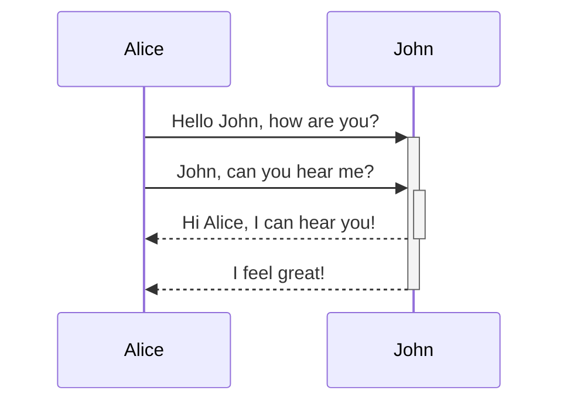
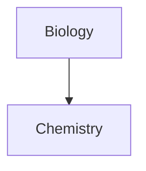

#Obsidian

🔼 [[markdown for Obsidian]]

##### Using Mermaid 

<pre><code>```mermaid
sequenceDiagram
    Alice->>+John: Hello John, how are you?
    Alice->>+John: John, can you hear me?
    John-->>-Alice: Hi Alice, I can hear you!
    John-->>-Alice: I feel great!
```</code></pre>



##### Linking to internal object
- Obsidian supports linking to notes in Mermaid:
````

````


##### How to Link in others way
````

````


- 이렇게 하면, 기존의 A,B에 추가로 할당되는 모든 변수에 내부 링크(internal-link)가 생성된다. 
- 문서 제목으로 특수기호를 사용하려면, `'` 또는 `"` 를 겹쳐 사용한다. 
	- `"⨳ special character"`
		→ `A["⨳ special character"]`