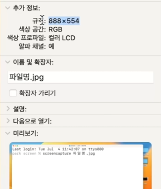
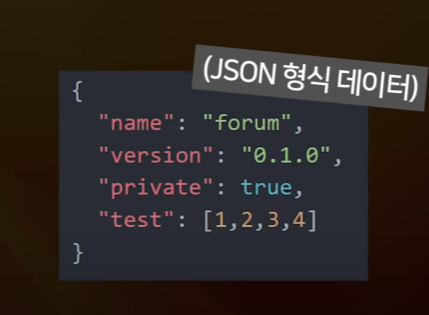
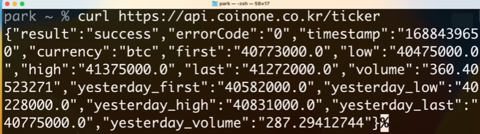
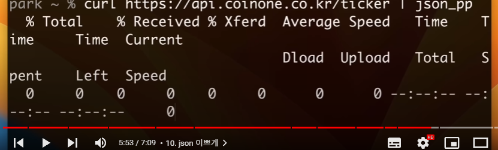
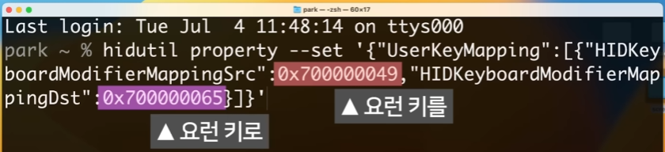
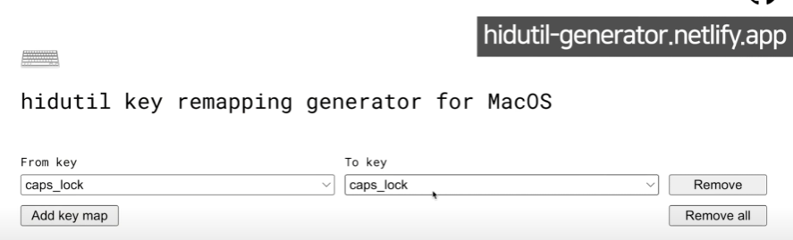

---
tags:
  - youtube
---
## 인생에 도움되는 맥북 고오급 터미널 명령어들 (일반인용)

- 유튜브 : https://youtu.be/EhiqpFtmjig?si=9NbpOzob2TH97Yll

### 1. 잠 안오게

```shell
caffeinate # 잠들기 모드 막아줌
# ctrl + C 로 종료

caffeinate -d # 디스플레이도 계속 띄워줌

caffeinate -d -t 3 # 시간 설정 가능
```


### 2. 바탕화면 정리

```shell
defaults write com.apple.finder CreateDesktop 0 ; killall Finder
# 바탕화면에 있는 항목들을 안 보이게 해줌

defaults write com.apple.finder CreateDesktop 1 ; killall Finder
# 다시 원래대로 돌림
```


### 3. 파일변환

```shell
textutil -convert txt 문서.docx # docx 파일을 txt 파일로 변환
textutil -convert rtf 문서.docx
textutil -convert txt *.docx # 모든 docx 파일을 txt 파일로 변환

```


### 4. 인터넷 속도 체크

```SHELL
networkQuality
```

- 최근부터 가능해진 명령어


### 5. 화면캡쳐

```shell
screencapture ~/Desktop/파일명.jpg # 해당경로로 캡쳐이미지를 저장해줌
```

- `cmd` + `shift` + `3~5` ⇒ 맥의 스크린캡쳐 기능


```shell
screencapture 파일명.jpg
screencapture -T 3 파일명.png # 3초뒤 png 형식으로 캡쳐 저장
screencapture -t pdf test.pdf # 파일 형식 변경
screencapture -c test.png # 이미지 저장 없이 클립 보드에 저장
screencapture -c
```


### 6. 이미지 축소

```shell
sips -Z 888 파일명.jpg # 이때, 숫자는 가로 사이즈
```



### 7. 외로울 때

```shell
say 바카바카 바카야로 # 해당 내용을 읽어줌
say 코딩애플 대머리 -o ~/Desktop/test.mp4 # 음성 파일을 저장
say -v Kyoko coding apple is the best # 음성 버전 변경가능
```


### 8. jot

- 연속된 숫자 또는 랜덤 숫자를 생

```
$ jot 4
1
2
3
4
$ jot -r 4
43
71
41
22
```

- 문자와 결합해서도 사용 가능

```shell
jot -w 안녕 3
jot -w 안녕 -r 3
man jot
```


### 9. 터미널 결과 카피

```shell
jot -w 안녕 3 | pbcopy # 카피됨
jot -w 안녕 3 | pbpaste # 붙여넣기
```


### 10. JSON 이쁘게

```shell
curl https://api.coinone.co.kr/ticker | json_pp
```







#### Q. 방금 복사한 JSON 이쁘게 하려면?
- 👉 터미널에 `pbpaste | json_pp`


### 11. 키 변환 (키배열 변경 )

- *단, 재부팅 시 초기화됨*




### 12. 당근하기 전

```shell
system_profiler SPPowerDataType
```
- 👉 내 맥북의 현재 상황 출력


### 13. 바로끄기
```shell
pmset displaysleepnow # 즉시 디스플레이 off

pmset sleepnow # 즉시 절전 모드로 변경
```


### 기타 궁금한 사항은?
- [ss64](ss64.com/osx/)에서 확인할 수 있다!