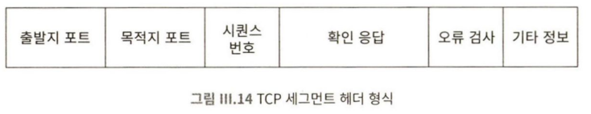

---
tags:
  - Linux
  - HomeServer
aliases:
  - 네트워크
---
```shell
sudo apt install net-tools

sudo netstat -plnut

sudo lsof -i -n -P | grep LISTEN

# 리눅스에서 열려있는 특정 포트 번호만 확인하는법
netstat -tnlp | grep 포트번호

```

#### 네트워크 경로 추적
```shell
tracert google.com

# 맥의 경우 traceroute
```

#### 임시 http 서버 띄우기
```shell
python3 -m http.server 8888
```

| 종류                                | 한국어                     | 내용                                                                                                                                                                                                                                                                                                  |
| :-----------------------------------: | :--------------------------: | ----------------------------------------------------------------------------------------------------------------------------------------------------------------------------------------------------------------------------------------------------------------------------------------------------- |
| IP (Internet Protocol)              | 인터넷 프로토콜            | 개별 패킷의 형식을 지정하고 패킷을 전송하는 방법을 정의                                                                                                                                                                                                                                               |
| TCP (Transmission Control Protocol) | 전송 제어 프로토콜         | IP 패킷을 데이터 스트림으로 결합하고 서비스에 연결하는 방법을 정의                                                                                                                                                                                                                                    |
| UDP (User Datagram Protocol)        | 사용자 데이터그램 프로토콜 | TCP와 같은 레벨의 또 다른 프로토콜이다. <br>UDP는 TCP보다 훨씬 단순하고, 양방향 스트림이 필요하지 않은 데이터 교환에 사용된다. <br>UDP는 몇 가지 제한된 기능만 제공함으로써 패킷을 효율적으로 전송할 용도로 쓰인다. <br>DNS가 UDP를 사용하고, 비디오 스트리밍 , VoIP , 일부 온라인 게임도 UDP를 쓴다. |




### Well Known Port
