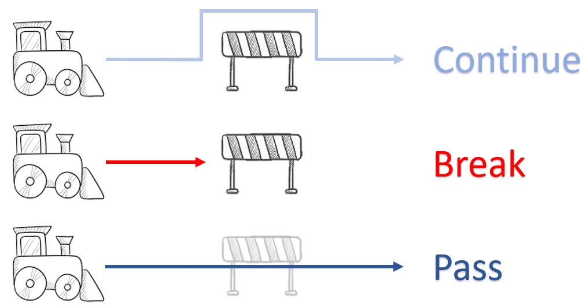

## Continue vs Pass vs Break



1. **continue** : 이후 부분의 코드를 건너 뛰고, 다음 순번의 반복문 수행.
2. **pass** : 실행할 코드가 없다는 의미. 이후 코드를 실행.
	- 조건문/ 반복문에 넣을 코드가 없을 때 (우선 코드 틀만 짜고 실행)
	- `class` 선언시, 마땅한 초기 값이 없을 때
3. **break** : 반복문을 멈추고, loop 밖으로 이동.


### 1. continue
```python
i = 0
while i < 10:
    i += 1
    if i % 2 == 0: # i가 짝수이면
        continue
    print(i, end=" ")
    
   >>>1 3 5 7 9
# 다시 while문 조건식으로 이동
```

### 2. pass
```python
i = 0
while i < 10:
    i += 1
    if i % 2 == 0: # i가 짝수면
        pass
    	# 여기서 부터(indented) 주석처리 (미실행)
    print(i, end=" ")
    
>>>1 2 3 4 5 6 7 8 9 10
# 조건문/ 반복문 실행에 영향을 끼치지 않음
```

### 3. break
```python
i = 0
while i < 10:
    i += 1
    if i % 2 == 0: # i가 '2' 일 때에
        break # break문 실행으로, loop 밖으로 이동
    print(i)
    
>>>1
# 실제 반복문은 2회 실행 ( i <-1, 2)
```
