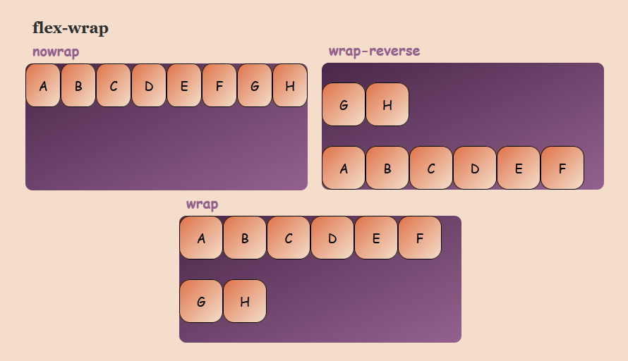
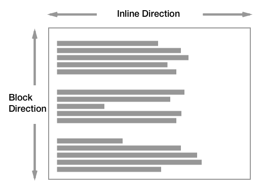

---
tags:
  - CSS
aliases:
  - 포지션
---
## MOC
```ad-note
- [align](#align)
	- [align-context](#align-context)
	- [align-items](#align-items)
- [axis](#axis)
	- [main axis & cross axis](#main%20axis%20&%20cross%20axis)
- [flex](#flex)
	- [flex-direction](#flex-direction)
	- [flex-wrap](#flex-wrap)
- [justify](#justify)
	- [justify-content](#justify-content)
- [Directions](#Directions)
```

### align
#### align-context
- flex-start
- stretch
- flex-end
- space-around
- center
- space-between


#### align-items
- flex-start
- stretch
- flex-end
- baseline
- center


### axis
#### main axis & cross axis
- Cross size
- Main size
- flex container
	- flex item


### flex
#### flex-direction
- row
- row-reverse
- column
- column-reverse


#### flex-wrap
- nowrap
- wrap-reverse
- wrap




### justify
#### justify-content
- flex-start
- space-around
- flex-end
- space-between
- center
- space-evenly


### Directions

- Inline Direction
- Block Direction


- Block Direction
- Inline Direction

