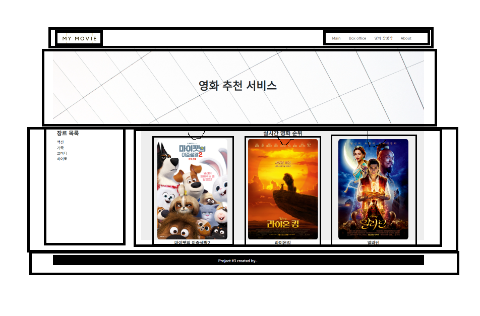
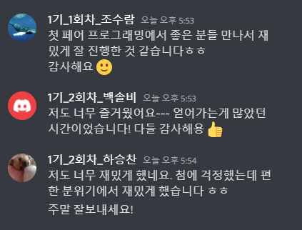

### Web-pjt : 페어프로그래밍 후기 (09.02)

- 2-3조 (하승찬님, 백솔비님)

   

- 좋았던 점

   나도 그렇지만, 주위 친구들도 '페어 프로그래밍' 이라는 데에 부담감이 많이 컸다. 전날에도 새벽까지 공부를 하고, 못다한 과제를 채우려 시간을 썼다. 하지만, 수업이 마치고 얘기를 나눴을 때, 하나 같이 다들 재밌고 유익한 시간이었다고 칭찬 일색이었다. 

   오늘 같이 프로젝트를 진행한 분들은 처음 만나는 분들이었는데, 그래서 처음에 약간의 아이스 브레이킹을 위한 시간이 필요했던 것 같다. 그래도, 처음 프로젝트 화면 구성을 위한 논의를 하면서, 금방 말문이 트이기 시작했고, 중간중간 농담도 해가면서  재밌는 시간을 가질 수 있었다. 

   재밌는 점은 디스코드를 통한 화면 공유로 서로 번갈아 가면서 코드를 작성했는데, 같은 툴을 쓰면서도 그걸 활용하는 방식이, 코드를 써내려가는 순서가 조금씩 차이가 난다는 점. 몰랐던 키워드나, 코딩 팁들을 배울 수 있는 시간이었다. 

   vs code에 실시간 코드 작성 확인 기능이 있는 줄 몰랐다. 처음에 접속하는데 문제가 있어 조금 애를 먹긴 했지만, 종종 써먹어도 재밌을 것 같다. 

  

- 아쉬웠던 점

   처음 보는 툴, 환경에 적응하는데 초기 시간을 많이 잡아 먹은 것 같다. 서로 번갈아 가며 '드라이버'와 '네비게이터'의 역할을 바꿀 때에도, 이것 때문에 조금 시간이 딜레이 되는 느낌.

   특히 '드라이버'의 역할을 맡았을 때, 수동-능동의 밸런스를 맞추는 게 어려웠다. 평소처럼 혼자 코딩할 때엔 마우스가 화면 전방위로 휙휙 넘어가고, 스크롤이나 예의 단축키도 자유로운 편인데, 오늘의 경우에는 몇차례나 코드 짜다가 미안하다는 말을 반복했다. 

   코드는 고독하게 혼자서만 짜는 것이란 고정관념이 있었던 것 같다. 처음이라 아쉬운 부분이 많았지만, '함께' 코드를 짜나간다는 것을 느낄 수 있는 시간 이었던 것 같다. 

- 훈훈한 마무리!

  

